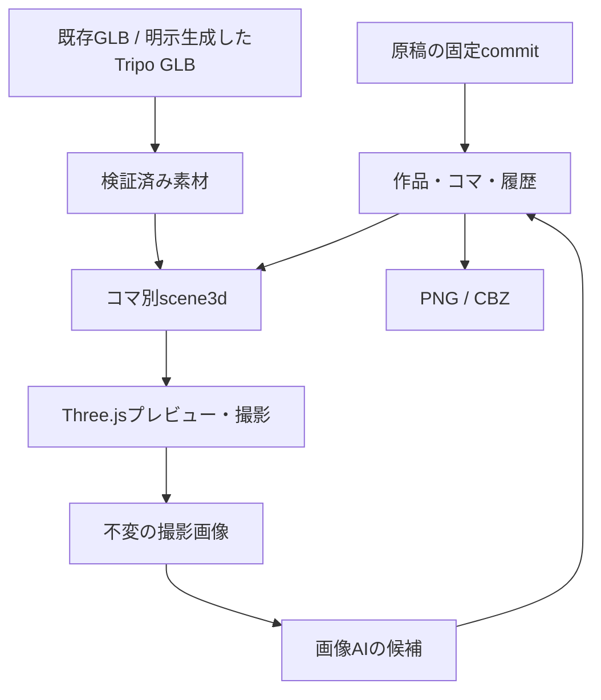

# Manga Mac 設計・実装計画 v5.0

更新日：2026-09-24。以下の「3D構図の現行仕様」は従来の3D接続に関する記述をすべて置き換える。下方の旧3D節は移行作業中の履歴であり実装指示には使わない。原稿・2D画像・組版・動画の既存条件は継続する。

## 3D構図の現行仕様（#279–#284）

- `project.sceneAssets` は利用者が取り込んだGLBまたは明示依頼したTripo生成GLBを固定ハッシュで記録する。素材を再利用し、未登録IDや不足ファイルを似た名前の素材へ自動置換しない。APIキーを作品へ保存しない。
- `panel.scene3d` が各コマの配置・ポーズ・カメラの唯一の正本。`schemaVersion:1`、`objects:[{id,assetId,position,rotation,scale,pose?,contacts?}]`、`camera:{position,target,fov}`、`background`。位置はメートル・Y上、回転はラジアン。構図編集は`add/remove/transform/pose/camera`の型付き操作を検証し、同じ作品保存・Undo履歴へ送る。
- Three.js画面はコマから開いたときだけ読み込む。GLBロード、配置、選択アニメーションの静止時刻、限定した接触制約、カメラ、PNG撮影を受け持つ。メッシュ／ウェイト／Rigの編集、物理シミュレーションは製品機能としない。リグ非対応素材をポーズ可能と表示しない。
- 撮影PNGは採用済みコマ画像と区別した不変CaptureRevisionとして記録し、原稿版・scene3d版・アセットの依存ハッシュを固定する。画像AIに渡すのは利用者が選んだ撮影画像と必要な人物／画風参照。候補採用・Undo・保存再起動でも以前の完成画像を失わない。
- 既存素材→不足時のみTripo→Scene編集→撮影→画像AI→候補採用を標準経路とする。外部送信は明示許可・上限・結果不明時の再送禁止を維持する。3D機能を使わずに従来の2D作画を続けられる。
- 旧3D連携の起動・接続・アドオン・UI・CI・導入経路は撤去する。旧撮影結果・採用画像・原稿は保持し、3D編集可能なデータへ根拠なく自動変換しない。容量・起動時間・メモリの削除前後を個別に測る。実機受入はBlender未導入環境で素材登録→配置→バスケの瞬間→撮影→画像AI→候補採用→Undo→再起動。

設計の正本：本書。開発時は最新 `dev`、配布版の確認は対応する `main` の版を参照する。

通常制作は原稿選択→ネーム確定→参照付き2D作画→仕上げ→出力。3D構図が必要なコマだけGLBとThree.jsで撮影する。Compositorはレイヤー編集に使う。

## 0. 本書の読み方

確定仕様は本書、操作は[USAGE](USAGE.md)、導入は[INSTALL_MAC](INSTALL_MAC.md)、コードと設定の入口は[DEVELOPMENT](DEVELOPMENT.md)、試験の実施履歴は[VALIDATION](VALIDATION.md)。変更領域の節だけを読む。過去の設計案・未マージPRを現在の実装として扱わない。

| 変更対象 | 読む節 |
| --- | --- |
| 原稿の版・範囲・ネーム・完了状態 | §4、§6、末尾「原稿からセクション完了まで」 |
| コマ・画像・文字の編集 | §7–8、§16 |
| 保存・移行・復旧・費用 | §9–11 |
| 動画 | §12 |
| バックアップ | §14 |
| 3D素材・撮影 | 冒頭の「3D構図の現行仕様」、§2–3、§4、§6 |
| 画像モデル・レイヤー・Compositor | §18と関連節 |
| 配信用出力・転送 | Live Manga配信用出力 |

モデルID・寸法・単価は `src/media-registry.json`、プロトコルは各 `contracts/`、依存版はlockファイルを正本とする。本書は選択理由・責務・検証条件を説明し、値の変更時は正本と整合させる。実装済みでも実機の画質・性能・実APIの受入を意味しない。

## 1. 製品の不変条件

- 脚本は外部で執筆し、原作リポジトリを正本とする。アプリは明示選択したdev/mainの同一commitから本文・設計・設定を読み取り専用で取得し、台詞・話者・順序・明示設定を創作／改変しない。原作へのpushやPR作成機能は持たない。
- 開発コードの正本は本リポジトリ。開発変更はdevから作業ブランチ→PR→devへ集約し、検証したまとまりをdev→mainのPRで反映する。原作の読み取り専用運用とは区別する。
- 通常体験は「対象脚本を選ぶ→漫画候補を作る→必要箇所へ自然言語で指示→出力」。手描きや毎コマのプロンプトを必須にしない。
- 3D素材は固定ハッシュ付きGLB、コマ固有の配置・ポーズ・カメラはscene3d、原作はSourceSnapshot、漫画のページ・採用画像・履歴はアプリが正本。
- 3Dから2Dへ描き直す際の見た目・空間の一致は保証しない。参照添付、原文保持、変更範囲、履歴など機械的に検証できる保証と、視覚品質を分ける。
- 外部APIは利用者が用途・送信先・送信対象を明示的に選ぶ。ローカルからクラウドへの自動退避、別事業者への無断送信、無制限再試行を禁止する。
- Apple Silicon／24GBを評価条件とするが、機種・OSは実機で取得する。実測なしで性能、品質、完成単価を断定しない。

## 2. 3Dと漫画の責務

| 対象 | 正本・担当 |
|---|---|
| 原稿 | 作品リポジトリのSourceSnapshot。不変・読み取り専用 |
| 3D素材 | `project.sceneAssets`のGLBとSHA-256。既存素材を優先し、不足時だけ明示的にTripoへ依頼 |
| コマの3D状態 | `panel.scene3d`。配置・ポーズ・接触・カメラは型付き操作で更新し、作品保存とUndoを共有 |
| 描画 | 開いたときだけThree.jsを読み込み、GLBからプレビューとPNGを生成 |
| 漫画画像 | 既存の画像生成Job、候補採用、局所修正、組版、出力。撮影結果と区別する |

LLMはscene3dへ適用する型付き操作を提案できる。コード生成や任意ファイル読み取りを操作経路にしない。登録素材、有限数値、対象コマ、リグ対応、接触状態を検証する。画像AIへ送る際は選択した参照とコストを明示する。

## 3. システム構成

`src/scene-model.js` は保存データと型付き編集、`src/scene-assets.js` はGLB登録・解決、`src/scene-pose.js` は限定したポーズと接触、`SceneViewport.jsx` は必要時の描画、`src/scene-capture.js` は撮影版の記録を担当する。GLBは作品へ保存したハッシュで参照し、UIのblob URLを保存しない。`main.jsx` は画面と既存保存境界の接続だけを担当する。

## 4. 素材と状態の保存

### 4.1 正本と参照

| データ | 保存・権限 |
|---|---|
| SourceSnapshot | GitHub repo／原稿commit／原bytes／取得順。不変 |
| CharacterBinding | 人物ID→2D参照版。3Dの人物と2D正本を混同しない |
| sceneAssets | 素材ID・種類・GLB保存先・hash。素材の自動置換をしない |
| panel.scene3d | コマごとの配置・ポーズ・カメラ。ほかのコマと状態を共有しない |
| CaptureRevision | 撮影PNG、scene3dと素材の版、設定、出力ハッシュ |
| ArtworkRevision | 撮影版、実入力、モデル・費用、元画像・マスク・候補・採用版 |
| PageLayout / EditIntent / Job | コマ枠、修正意図、工程依存、費用、復旧情報 |

原稿インターフェース（#143）の形式正本は `contracts/story-source/` の `story-source/v1` 契約とする。story-libraryの作品入口は `works/{workId}/work.json` で、リポジトリ名や作品名から仕様を推測しない。旧repoの `manifest.json` / `source/manifest.json` は読み取り互換だけにする。manifestは `work.title`、入れ子の `episodes[].scenes[]`、`settings[]`、`characters[]` を持ち、読書順と話への所属は配列順を正本にする。場面の現在位置は配列から `P1-3` のように表示し、`id`は位置・タイトル・本文の変更後も維持する固定IDとする。

本文パスは作品root相対で明示し、共通規則の `manuscript/p01/p01-03.md` へ解決する。入口ファイルの置き場所から相対基準を推測しない。配列順と現在の連番パスが一致しないmanifest、IDの重複・再利用、危険なパス、未登録・欠損ファイルを検査で拒否する。設定は `settings/`、人物基準画像は指定する場合に `assets/` に置き、人物はファイル名やMarkdownのalt文言から推測せず、人物IDと指定した画像パスで宣言する。設定・人物がない作品も `settings: []`、`characters: []` で表現する。

`contracts/story-source/validate.mjs` は形式・ID・パス・タグ・本文見出し・宣言ファイルの過不足を機械検査し、本文の文字列を正規化・生成しない。`paths.mjs` は安全な参照と連番パスを、`structure.mjs` は話・場面の追加・移動・削除・再採番計画を提供する。構造計画は固定IDと本文ファイルの対応を保ったまま、衝突しない一時退避を含む移動計画を返す。削除済みIDの台帳は呼出し側から検査へ渡し、再利用を拒否する。

共通契約の形式正本は `contracts/story-source/` に置き、manga-macの `source-protocol.js` はこのvalidatorを読み取り時に利用する。story-source/v1は同一commitのmanifest・本文・設定・人物画像を取得する単一正本で、旧schema 1/4は既存snapshotを保持する読み取りadapterとして残す。人物は固定IDを優先し、旧形式でIDがない場合の名前対応付けが複数候補になるときは推測せず失敗する。

同期入口はmanifestを手動確認したときだけ読み取り、未対応形式・危険なpath・見出し不整合・宣言画像の通信失敗や欠損では現在のsnapshot、漫画、保存データを変更しない。宣言画像の実バイト列がPNG/JPEG/WebPでない場合に限り、その画像を人物参照へ登録せず `snapshot.unavailableReferences` に人物名・path・理由を記録し、差分確認と取込後の画面で警告する。代替画像は推測しない。manifestの差分はscene・setting・人物ID/path・画像hashとして表示し、commitだけの変更は「更新なし」とする。`work.json` を優先し、旧 `manifest.json` / `source/manifest.json` は読み取り可能にする。manifest内のpathは常に作品root相対の正本として保持し、repositoryや作品名から構造を推測しない。

場面は任意の `tags: ["駅", "再会"]` を保持する。最大64個・各80 Unicode scalar、非文字列や空白のみを拒否し原値を変えない。原manifestをsnapshot.manifest、正規化した本文/設定/参照をsnapshot.scenes/settings/referencesへ保存する。snapshot.protocolは解釈版、snapshot.syncは実取得commit・manifest原文SHA-256・日時を持つ。旧snapshotのcontractは履歴として保持するが新規仕様解決に使わない。画像のsafePath・実形式・20MB上限・SHA-256は既存Rust境界で確認し、明示取込み時だけ人物参照へ反映する。

原稿画面のタグ検索（#131）は表示値を保持したまま、検索キーだけNFKC・前後空白除去・小文字化し、最初の表示値を残して重複除去する。ANDは同一scene内、ORはscene単位で判定し、原稿順を保持する。条件変更で生成や転送は実行しない。一括選択は既存差分block/groupへ解決し、他sceneへの拡張は対象を示して確認する。実行中groupは選択しない。既存sourceSelectionで開始時のsnapshot/contentTokenとblock IDを検査する。タグ未定義の原稿は既存操作を維持する。閲覧用投影・転送の通し受入は#130/#135とlive-manga#22で扱い、本検索UIだけでは転送完了にしない。

旧schema 1/4は現在のアプリ同期経路が持つ互換入力であり、新規原稿の正本形式ではない。schema 5の最小読書順台帳はscene/settingsの解決宣言を欠くため、現行経路では未対応と明示する。原稿側の固有ディレクトリ走査をアプリへ転載せず、現行原稿を `story-source/v1` へ移行し、同一manifestから確認サイトと漫画アプリへ接続する作業を #136 と後続Issueで行う。

コマのscene3dが配置・姿勢・カメラの正本。撮影版はscene3dの入力と素材hashを固定し、旧撮影画像を上書きしない。

### 複数の原稿連携先（#106）

作品表示名・GitHub repository・選択中episodeをアプリ共通の登録一覧へ保存する。本文を登録一覧へ複製しない。既存作品はprimaryの保存領域をそのまま登録し、新規作品には独立したSQLite・画像・動画・3D素材・履歴・Job領域を作る。作品切替は既存workspace切替・再起動を使い、進行中処理のロックを維持する。GitHub tokenは起動中だけ保持し、切替後は再入力する。既存原稿元は登録後に別repoへ付替えず、追加操作を使う。

新規原稿元も同じ汎用protocolを検証する。未接続の初回作品には既定repoを割り当てず、利用者が接続先を指定して登録する。コミット固定・原文非改変・safePath・画像hash検証は既存同期経路を使う。

### 原稿の手動取込み（#107）

原稿の更新確認は取込み画面の「変更を確認」または原稿工程の「更新を確認」の明示操作のみ。起動時・定期の自動確認は行わない。通常はGitHub APIを使用する。アプリデータの `local-source.json` にrepoと絶対pathを明示した作品だけは、原稿一覧の読み込み・変更確認時にアプリが選択ブランチを `origin` からfetchし、ローカルGitの `origin/dev` または `origin/main` をcommitへ解決する。取得に失敗した場合は保存済みsnapshotと漫画を維持してエラーを表示し、古い追跡refで更新なしと判定しない。`git cat-file` で本文と画像を同じcommitから読み取り、作業ツリーには依存しない。アプリはpull・pushを実行しない。場面／設定／参照画像の追加・変更・削除とmanifest変更の概要を一時表示し、「取り込む」で同一commitの不変SourceSnapshotをactiveにする。未取込みの候補はメモリ内だけに保持し、再起動・対象作品／話変更で破棄する。確認失敗・保存失敗では既存正本と漫画を維持する。旧snapshotは既存漫画の出所・履歴として保持し、最新正本はactiveの1版とする。漫画への反映状態のdiffとは別処理である。

### 原稿範囲と漫画への反映（#114 確定契約・段階実装）

SourceRefは不変snapshot ID・scene ID・Unicode scalarの半開区間startCp/endCpを持つ。scene.textは改行・空白・Unicode正規化をせずSHA-256で固定する。JSのUTF-16位置とRustのUTF-8位置は解決時だけ変換し、永続座標にしない。panel.sourceRefsは描写の一次対応、contextRefsは文脈、lettering.boxes[].sourceRefsは掲載文字。文字枠は独立IDを持ち、ページには既存panelIdだけを配置する。

project.sourceApplication.version=1のunitsは、実際に漫画へ反映した原稿の順序付き参照列。unitはid/source/requiredTextを持ち、本文を複製しない。異なるsnapshotを混在できる。一次参照の和集合で本文を被覆し、requiredTextは文字枠の読書順で欠落・重複なく被覆する。描写参照は重なってよい。必要画像と配置が未完成なら反映済みにしない。既存作品は対応する旧snapshotのunitIdsからのみ移行し、欠損時は元データを残して診断する。schema 5は旧アプリによる欠落保存を拒否する。

比較は反映参照列Bとactive原稿Tの本文段落。jsdiffのdiffArraysを上限付きで使い、一意の一致をアンカーにし、変更区間の曖昧な反復は一組の置換へ広げる。移動は削除と追加を同時選択し既存IDと画像を再利用する。ChangeSetは作品・基準token・対象snapshotを含み、取込や編集後の選択を転用しない。AIを呼ぶ前に選択ブロックだけからB'を確定し、未選択の旧版参照を維持する。

確定は既存SQLiteトランザクション内で最新作品・native発行contentToken・targetSnapshotId・opIdを照合し、漫画、反映参照列、Undoのbefore/after、確定記録を一括保存する。Job進捗はtokenから除き、remote metadataと費用を古いUIで巻き戻さない。同一opIdはUndo後も再実行しない。Undo/Redoは漫画と反映参照列だけを戻し、最新原稿activeは戻さない。対象外の内容と許可配置区間外は不変とする。

描画・書出し・字幕は共通の範囲解決を使い、日本語offsetを英訳へ流用しない。完全一致の旧段落英訳だけ再利用し、部分範囲に対応がなければ未更新とする。初稿も空Bから同じ検査を経由する。

段階実装の範囲: 範囲解決、旧履歴を含む移行関数、B/T差分、nativeのprepare_source_patch／commit_source_patch、被覆・読書順・配置の境界検証、Undo/Redoを追加。prepareは既存JobにB'と影響範囲を固定し、commitは既存保存の内部関数を単一トランザクションで共有する。確定receiptはUndo・再起動・古いUI保存でも消さない。共有コマの内容変更は新IDとreplacesPanelIdsで置換元を示し、未選択の一次原文を再構成先で保持する。Mac起動時は既存保存経路でschema 5へ変換し、保存成功後だけ画面へ返す。変換前は既存バックアップで保持する。作画待ちコマには文字配置を補完しない。文字配置AIは独立box IDと厳密な原文を受け、返却した形状へアプリ側が不変SourceRefを戻す。固定枠・原文参照・順序の変更を拒否する。大入力ではscene IDの対応を使って粗い差分を場面ごとに限定し、処理不能を更新なしにしない。原稿画面からの選択・更新案・原子的確定を#108の接続で利用する。#115/#116/#108がこの契約を利用する。未接続の関数を利用可能な原稿反映機能とは扱わない。

### 4.2 舞台・瞬間・カメラ

同じGLBを複数のコマで共有しても、transform・pose・cameraは各コマのscene3dだけに保存する。静止時刻でアニメーションを評価し、対応する骨格がない場合は明示して撮影を拒否する。簡易接触は足接地・手とボール・視線を対象とし、競技の全動作や物理計算を行わない。

### 4.3 保存版と素材更新

GLBの内容は登録時のhashで固定し、作品内の各shotは素材IDとscene3dを保持する。素材更新は新しい版として登録して使用コマを明示的に切り替える。完成画像・旧撮影版を自動更新しない。

## 5. 1ページを作る作業とデータの流れ

原稿からコマ割り・2D作画が通常経路。構図が必要なコマでは、既存GLBを選び、未登録の必要素材だけを取り込みまたはTripoで生成する。コマ固有のscene3dに配置・ポーズ・カメラを保存し、プレビューで確認してPNGを撮影する。撮影版を参照に画像AIが漫画化候補を作る。採用・局所修正・文字・ページ書出しは既存工程を共有する。構図だけ変更しても画像AIは実行されない。

### 5.1 日本語原作と英語版

- 対応する作品言語は日本語と英語だけとする。アプリUI自体は日本語のままにし、任意言語コードやUI翻訳基盤は導入しない。
- GitHubから取得した日本語原作を唯一の正本とし、英訳は `snapshot_id + unit ID` に対応する派生版として保存する。原文、話者、段落ID、順序を変更しない。
- 英訳要求は全unit IDを一度ずつ同じ順序で返す型付き契約とし、欠落、追加、重複、空文、並べ替えを保存前に拒否する。資格情報は既存LLM接続境界を使い、作品データへ保存しない。
- 漫画と動画は同じ英訳版を参照する。漫画は文字層だけを日本語／英語で切り替え、採用済み作画を再生成しない。動画は同じunit IDからWebVTT等の字幕トラックを作り、映像素材を言語ごとに複製しない。
- 英訳がない、または対象snapshotと一致しない場合は「英語版」として日本語を黙って出力しない。画面で未作成を示し、PNG／CBZ／字幕の英語出力を拒否する。
- 原作新版の取得後も旧snapshotの英訳は履歴として保持する。新版用英訳は別版として作成し、旧英訳を自動流用・自動修正しない。
- 現段階の動画側は字幕データ契約とWebVTT生成までとする。字幕焼込み、吹替音声、口パクはIssue #9の初期無音1ショット範囲外であり、実装済みと表示しない。

## 6. 撮影パックと画像AIの接続

撮影はThree.jsの指定カメラと解像度からPNGを生成する。素材ハッシュ、scene3dの保存版、描画設定と画像ハッシュをCaptureRevisionへ固定する。未対応の深度・法線・線画パスを生成済みと表示しない。

画像アダプタは参照画像枚数、画像編集、mask、depth、normal、pose、line、最大解像度、課金方式等の能力を確認する。名前は接続契約の能力項目であり、既存プロバイダのAPI名を捏造するものではない。未対応の深度画像を普通の参照画像として渡して「深度拘束済み」と扱わない。

まず撮影画像と2D正本で漫画化し、モデルが対応するガイドだけ追加する。2D人物正本は3Dモデルの見た目と独立して実入力に含め、ID・版・ハッシュ・順番を記録する。必要参照を黙って省かない。全面変換の構造保持は検査対象であって保証ではない。

NPR／Line Artのみで十分なコマはそのまま利用可能にし、画像AIの使用／不使用自体を目標にしない。画像AIは補修専用ではなく通常の作画工程として利用できる。[B5]

### 選択差分の計画・候補生成・確定（#108）

SourceUpdateは共通差分の選択をnative prepareで既存Jobへ固定してから既存plan接続を呼ぶ。content-replanの応答契約を拡張し、文境界でアプリが作ったatom ID→不変SourceRefだけをモデルへ渡す。未選択の共有原文は現在の漫画の旧版から含める。全atomの一度ずつの読書順を照合し、本文offsetや自由文をモデルから採用しない。内容が変わるコマはopId由来の新ID、移動は旧ID・画像・原文参照を維持する。

AIが選ぶ画像再利用は更新案で確認する。新IDへは採用画像とcropを引き継ぎ、旧コマ専用の撮影bindingを転用しない。配置は#116の同一基準の区間置換を使い、前後のページと手動要素・動画対応を検査する。新規作画はproductionの既存beginJob/finishJob、FLUX要求・receipt復旧を共有する。nativeはsourcePatchOpの候補・作品・基準・対象原稿を照合して予約する。採用漫画を変えず候補内へ素材を保存し、停止後は不足分だけを再開する。unknownの結果は復旧を確認し、再生成で置き換えない。新しい生成キューや原稿DBを持たない。

必要素材が全て揃った後、既存pagePNGで文字収容を確認し、明示適用で#114の単一transactionへ渡す。漫画・反映列・Undo/Redo・receiptを同時保存し、旧panel IDを含むlayout履歴を安全に退避する。台詞／削除／移動だけなら作画要求は0回。既存一括初稿も素材完成後に同じprepare/commitで選択場面の反映を確定する。表示・選択・外部原稿の取込み・計画成功だけでは反映済みにしない。実モデルの演出品質はfixtureによる通信・保存境界の検証とは区別する。

### 選択差分の並列実行（#129）

原稿の追加実行は全画面busyと分離し、既存sourcePatch Jobにrun/group・固定した選択・依存キー・工程を付加する。複数選択は共有コマ・原稿単位・context参照・配置ページ・挿入境界を共有する連結成分へまとめ、別の実行から重なる範囲は採用／停止まで待機する。タグ文字列を実行時に評価せず、呼出元が解決した実block IDと任意のscene IDを開始時に固定する。選択・表示だけでは生成しない。

共有の小さな資源待機列を既存入口へ接続する。ローカル画像／Ollamaは共用推論枠1、外部LLMは同一接続で最大2（逐次設定は1）。モデル・接続先の自動切替はない。画像AIと重い撮影処理は実機で資源を確認し、送信済み要求のunknownを自動再試行しない。

作品保存は一つの短いwriter列へ集約する。非同期Job更新は最新作品への更新関数とし、古い全体objectはtoken／保存revisionが違えば拒否する。通常native保存もIMMEDIATE transaction内でworkId/contentTokenを比較する。sourcePatch prepare・rebase・採用も同じwriter列に入り、推論中は保存排他を保持しない。Job進捗は内容tokenを変えない。

prepare時にnativeで対象原稿unitと前後アンカー、scope内ページ・コマ、contextに依存するコマ、crop・配置設定・人物／画風参照・動画対応・入力snapshotから読取り依存hashを固定する。独立した採用で全体tokenが変わっても、同じ選択操作／scope／読取り依存が維持される場合だけ既存差分計算から最新Bへ操作を再構築し、native rebaseで検査・保存する。最新sourceApplication全体へ旧候補をコピーしない。再構築した局所配置を#116、被覆と採用を#114で再検査し、確定transactionでも依存とtokenを確認する。実際の依存変更は候補を保持して再確認を要求する。旧版の依存hashなし候補は同じ全体基準でだけ検査を追加でき、古い基準へはrebaseしない。

個別停止／全停止は独立処理を巻き戻さない。遅い応答は更新案に保持し、自動採用しない。再開は不足素材だけを既存image Job／receiptから回収し、unknownを再POSTしない。完了opIdは応答消失・再起動・Undo後も重複採用しない。Undoはグループの漫画と反映列だけを戻し、取得済み素材や費用は維持する。人工応答の並行・逆順完了・独立採用・停止／再開と保存競合を通常試験とし、実機速度やメモリの倍率を推測して報告しない。

## 7. 修正の振り分けと保護

| 指示 | 変更する正本 | 再実行範囲 |
|---|---|---|
| 二人の距離、身体ポーズ、カメラ角度 | 対象コマのscene3d | 対象の再撮影→必要な漫画化 |
| このコマの口元・目線の小修正 | 2D作画版 | 領域の再編集・合成。通常は3Dへ戻さない |
| 次のコマも同じ表情 | 次のコマの演技意図と2D参照 | 次コマに適用。修正済み2D顔を自動3D復元しない |
| 線・トーン・背景の省略 | 作画／合成設定 | 撮影原本を再利用して必要な仕上げ |
| 吹き出しの移動・文字配置 | ページレイアウト | 組版のみ。LLM・画像AI・3D再撮影は不要 |
| 人物素材の更新 | 新しいGLB版 | 利用コマに候補を作る。既存採用版は不変 |

全操作に対象ID、`scope`、原作版、`base_revision`、編集意図、予算を付ける。既定scopeは選択コマ／選択人物。場面全体の修正は明示指定に限る。図の正しさをDBの状態保存だけで保証しない。

2D修正後にカメラを変えた場合は、修正意図と採用顔を参照に新しい候補を作る。旧画像や旧マスクを新角度へそのまま適用しない。漫画化で輪郭が変わるため、3D由来の領域は手掛かりとし、完成画像上で領域を再確認する。安全に分離できなければ要確認とする。

既存の領域合成・マスク外RGBA保護を維持する。2DのCompositor編集と既存の画素保護を使い、汎用画像処理基盤を二重にしない。境界処理も許可マスク内で行う。

### 自然言語編集と初稿統合（#60～#64の段階実装）

`produce()`は原文対応計画→既存AIページ配置→既存逐次演出/作画→文字初期配置→同じ`pagePNG`での検証・表示を接続する。工程は既存jobsに`draft_layout` / `draft_lettering`として保存し、完成画像や既存文字配置を再生成しない。文字配置の失敗は作画を保持して再開する。原作取込前と別初稿開始時に既存漫画historyへ原稿チェックポイントを保存する。対象sceneIdsとsnapshotIdをdraftScopeに固定し、選択範囲だけ計画する。旧コマ・配置・文字・人物参照・動画割当は「保存した原稿」から復元できる。jobs/artworks/動画成果物は巻き戻さず、未確定画像要求がある切替は停止する。新しいコマIDは初稿IDで分離し、通常Undoは原稿切替境界を越えない。

自然言語の共通入口は表示ページの読書順とstable panel IDを渡す。軽量な文字・枠・crop変更は既存setLettering/changeLayoutから一括検証・既存漫画historyへ一件として保存し、Undo/Redoを行う。手動文字操作も同じvalidator/setLetteringと描画関数を使う。AI応答が旧版なら採用しない。軽量編集の自動適用は初期オフの利用者設定。画像再生成は候補として扱う。旧履歴や枠専用Undoも維持する。

編集候補は既存jobsのedit_proposalに保存する。画像を複製した基準文字列ではなく、原作/コマ/配置/人物参照/動画割当のhashで採用可否を照合する。再起動後の比較は既存pagePNGを共用。生成複合は軽量操作を先に一括保存し、その後に対象別の既存生成候補を逐次作成する。既存jobsのedit_executionへ完了操作数を記録し、失敗・停止・未確定を全完了にしない。同じコマの連続生成は先の候補採用後に別指示とする。実行開始した提案を再起動後に自動再送しない。

画像を使う対象認識は、利用者が選択済みLLMへの作画送信を有効にした場合だけvision用途で実行する。既存の画像入力・通信ポリシーを使い、Jevへは送らない。対象矩形は原画像の正規化座標。未知/曖昧/不正値は停止し、認識結果を重ねて確認できる。領域編集は既存マスク合成を使い、矩形外RGBAを保持する（服の輪郭に一致する保証ではない）。文字配置への変換は既存contain/crop・コマ形状と同じ式を使い、認識した顔/手等のavoid領域と文字枠の重なり、crop後のsubjectの見切れを検証する。画像対応能力・認識精度は実モデルの別受入とし、構造化応答だけで保証しない。

Jevは任意・初期未設定の判断専用接続。2026-09-17に[公式API](https://docs.typesafe.ai/api)の `POST https://api.typesafe.ai/v1/systemone`、Bearer、state/model/questions、choice回答を確認した。既存Connections/PolicyTransport/取消/一要求一POSTを再利用し、チャット互換として扱わない。キーは起動中メモリだけ、判断入力は修正指示・表示対象ID・実行可能操作のみ。画像・原作本文は送らない。0.75の確信度閾値は未校正の暫定値であり正答率ではない。未設定時は明示選択済み演出LLMのみを使い、障害時は別の接続へ退避しない。

解像度診断・補間拡大・元画像参照仕上げは既存処理を共用し、動画準備・保存済み動画割当も既存shotFromPanel/assignMotionへ接続する。自動の有料動画POSTは追加しない。

文字枠は既存unit_idに対応する任意の安定ID、kind（balloon=吹き出し、thought=枠なしの心中描写、narration=四角ナレーション）、角丸/長方形/楕円、しっぽ、文字サイズ/行間/余白、固定状態を後方互換追加する。描画はOS Canvasで共用する。ドラッグ/リサイズ/しっぽ先端は一操作で保存し、Escape/pointercancelは破棄する。AI初期配置は既定で文字量と読書順を使い、作画送信を有効にした場合は認識した重要領域も使う。直接操作の下絵もページ共通描画から切り出し、crop後の見た目と座標を合わせる。機械的なページ/原文/文字あふれ検証と実モデルの品質合格を区別する。

## 8. UIとプレビュー

### 既存導線での制作品質改善（#269）

- 文字枠の`writingMode`（`horizontal-tb` / `vertical-rl`）と`fontFamily`（`gothic` / `mincho`）だけを追加する。未指定は従来の横書き・sans-serif。JS/nativeの検証と既存保存・Undoを共用する。ネームv2編集は実枠の縦横比で`drawNameLettering`を共用し、画面とページの改行・既定文字サイズを一致させる。
- 縦書きは書記素単位の右から左への列配置、改行・基本禁則、OSのSVG文字組版による縦用字形を使う。英数字は正立1文字1枠。SVGは外部資源を含まず、出力先の密度でCanvasへ合成する。ルビ・縦中横・任意フォント管理・作品全体の書式一括適用は範囲外。[W3C日本語組版要件](https://www.w3.org/TR/jlreq/)の全面準拠は主張しない。
- PNG/CBZのみ出力幅800/1600/3200pxを選ぶ。座標正本は1600×2260のままCanvasの描画倍率を変える。PNG/CBZで同じrendererを使い、CBZの来歴へ実寸法を記録する。選択はUIの起動中状態であり作品の保存形式を増やさない。Live公開契約の寸法は変更しない。
- 出力メニューを開いたときだけ画像ヘッダと既存`panelArtRect`で必要画素数を調べる。解像度不足・寸法不明は警告で、作画を自動再生成しない。元画像の細部やAI品質の合格判定には使わない。
- 完成出力は対象コマのv2必須台詞の被覆・読書順と、文字配置が採用作画版に対応することを既存の完了検査と共通判定する。PNGは対象ページだけ、CBZ・Liveは出力全体を検査する。未作画・未割当・台詞欠落・文字配置未確認は出力メニューから修正する工程へ移動できる。下絵や編集中のプレビューは完成扱いにしない。
- 仕上げプレビューはページ・参照データ・言語・配置が一致した描画結果だけを表示する。別ページや更新前の画像を待機中・失敗時に残さず、遅れて届いた結果を破棄する。編集対象は表示中ページのコマに限定する。
- 保存したAIコマ割り候補は現在のページに関係する案だけをページ全体のキャンバスに仮表示する。複数ページ案はページ送りで確認し、判断中の主操作を「採用して編集」「採用せず編集」の二択に絞る。判断前には採用済みlayoutを変更せず、両方の選択後に通常のドラッグ編集へ戻す。採用は候補の配置を保存し元の作画を保持、非採用は元の配置を保持してJobへ破棄を保存する。再起動後に破棄案を復活させず、別の保存候補は通常の編集画面から選ぶ。基準版が変わった案は採用を拒否し、非採用で編集を再開できる。
- 前後比較は現在のページ配置順と既存人物参照を読む。開いたときだけ画像を表示し、未作画・別場面を示す。候補比較はJobの`base_revision`に対応する画像を使い、新しい採用画像へすり替えない。候補採用検証・履歴は変更しない。

衣装・小物の新台帳、PSD完全往復、印刷入稿、共同編集、自由ブラシ、新しいレイヤーエディタは今回追加しない。局所修正の範囲外画素保持・既存Compositor・明示採用を使う。Macの書体・縦書きの見た目とメモリは#266で受け入れる。

主画面は「原稿」「コマ割り編集」「作画」「仕上げ」の工程で切り替える。原稿がないときは空の制作欄・無効な工程操作を出さず「原稿を開く」を主操作にする。作品・話・ブランチ・取込範囲は同じ取込み画面で選び、作品を確定する前に登録・再起動しない。別作品の選択を確定した場合のみ保存してworkspaceを切り替え、再起動後に取込み画面へ戻る。出力は上部の「書き出す」へ集約し、設定と動画は必要時に開く。仕上げでは出力と同じページを表示する。原稿の更新確認は原稿工程から直接行い、毎回設定を開かせない。原稿工程の左欄は取得済み話・場面を表示し、場面選択は本文への移動だけを行う。タグで絞り込み中に場面へ移動すると全場面を表示し、漫画の選択・原稿版・取込範囲は変更しない。原稿の範囲選択操作、コマ割り編集の操作列、作画工程の選択コマの実行、仕上げ工程の対象コマ選択は長い本文・ページのスクロール中も表示する。作画中に対象コマの3D構図を必要時だけ開き、既存GLBの配置・ポーズ・カメラ・撮影を同じ画面で扱う。撮影原本と採用済み漫画画像は区別して表示する。

原稿カタログ・作品／話・初回取込み・更新確認の失敗は、操作名とbuildを持つ診断として表示する。未対応操作、認証・権限、対象不在、通信、取得上限を区別し、次の操作を示す。診断コピーは既知の技術的エラー／HTTP状態だけを含み、認証値・任意の原稿本文・画像・ファイルパス・自由形式の応答本文を含めない。再試行前に作品・話・取込範囲・既存採用版を保持し、ブランチ変更は取得成功時のみ確定する。ブラウザでは原稿取込みを開始させず、Macアプリ専用とサンプルの範囲を先に示す。

Three.jsのビューポートで構図確認し、GLBの取得・リグ解決に失敗したときはその対象を表示して撮影を拒否する。必要な時だけ読込み、画面を閉じたらGPU資源を解放する。

静止ポーズに対応するリグは、人型の左右腕・脚と腰が一意に見つかり、骨が同じSkinnedMeshにbindされ、関節の親子関係と各肢の長さ（0.02〜3m）が有効なものに限定する。接触は手持ちのボールを主手のsocketから一方向に配置した後、反対の手を固定したボール上の接点へ合わせる。足先は世界座標の固定目標へ合わせ、空中の人物には接地を適用しない。腕・脚の2関節IKは24反復、接点誤差0.035m以内、関節回転上限2.5/2.4radを条件とし、到達不能・収束失敗時には骨を直前の状態へ戻して撮影を拒否する。これらは対応リグの静止構図用制約であり、任意リグの修復や物理衝突の自動解消ではない。

自然言語だけでなく「寄る／引く」「別構図」「撮影」の定型操作を置ける。実処理はscene3dの検証済み操作を呼び、生成中の画面位置・入力・選択を保持する。

## 9. 履歴・依存・費用・復旧

依存は `SourceSnapshot→PanelPlan→ShotBinding/CaptureRevision→ArtworkRevision→PageLayout/Export` とする。台詞だけの誤字修正は再組版、演技が変わる本文差分は対象の視覚依存を再評価する。原作全体のhash変更だけで全画像を再生成しない。

ジョブはキュー、入力ハッシュ、request ID、基準版、試行数、バックエンドjob ID、実行時間、費用、出力を保存する。3D構図は保存版scene3dから再表示して確認する。ファイル保存・検証成功後にDBの採用ポインタを切り替える。unknownの課金要求を盲目的に再送しない。

ローカル画像生成も、送信前に既存Jobへ要求hash・復元文脈を固定し、helperがPNGとhash receiptを永続化してから完了通知する。応答不明時は同じJobの保存結果を検証し、手動で候補として回収する。局所編集は不変の元画像と確認済み矩形から既存合成器で再合成し、未合成画像を候補にしない。回収からの新規推論・自動採用は行わない。

失敗・キャンセル・古い版の結果は採用済み成果物を壊さない。Undoはコマのscene3dと不変の撮影画像／作画版を戻し、再推論しない。DBと素材の整合を含めバックアップ・復元を検証する。

費用は素材生成・検査・修正の初期費用と、完成ページの反復費用を分ける。構図探索中は画像AIを呼ばず、確定後に漫画化し、部分修正は対象コマだけ。実料金／推定料金／未取得を区別する。

品質再試行は初回＋最大2回を設計上限とし、課金再試行は利用者が許可した予算内に限る。回数を再起動でリセットしない。無断の自動リトライを既存実装に追加しない。外部サービスがすでに持つ進捗・再取得機能を再利用し、親子jobの対応だけアプリへ保存する。

24GB機では3Dプレビュー、画像モデル、ローカルLLM/VLMの負荷を実測し、不要なGPU資源を解放する。利用者のプロセスを勝手に停止しない。

## 10. 導入と移行

旧2Dコマと既存の採用画像・撮影画像は保持する。旧3Dファイルから新しいscene3dへの変換は行わず、必要なコマだけユーザーが構図を作り直す。GLBを読み込むThree.jsは3D画面を開いたときにだけ起動する。素材を使用しない2D制作の初期表示と保存を回帰確認する。アプリ本体はデスクトップ配布し、利用者へソースビルドを要求しない。

## 11. 実装順序と受入条件

1. コマ別scene3dの検証・保存・Undo、Three.jsプレビューとカメラ、GLB取込み。
2. リグ検査、静止ポーズと接触、バスケ構図の検証。
3. PNG撮影を不変版として保存し、画像AI入力→候補採用・Undoへ接続。
4. 旧接続と導入依存を撤去し、未導入Macで全工程を確認。容量・起動時間・メモリを削除前後で測る。

本文・画像・他コマ・既存Jobを変更せず、紐付かない素材や未対応リグは撮影前に失敗を表示する。実Mac上の品質とAPI課金は別に確認する。

## 12. 動画1ショットへの共通参照（Issue #9）

漫画の原作・人物・作画・撮影版を再利用する。`videoShots`は既存snapshotId/sceneId/unitIds、人物ID、開始画像の不変版/hash、動きの指示、尺/寸法、採用動画版を持つ。原文や3D素材を第二の編集可能モデルへ複製しない。漫画コマを動画ショットの必須親にはしない。

schema 4へv1/v2/v3を互換移行し、既存panels/history/jobsと作品言語データを保持する。`videoRevisions`と`videoHistory`は動画用の版・Undoだけを担い、制作要求は既存jobsのscope=`videoShot`へ追加する。動画操作で漫画historyを変更しない。旧schemaのアプリへ戻す際は移行前の作品フォルダを復元し、version番号だけを書き換えない。

開始画像は既存ArtworkRevisionまたは固定CaptureRevisionから実bytesを解決・hash照合する。jobのmanifestへ原作commit、対象範囲、作成元版、接続ID/モデル、実入力hash、変換、指示、出力条件、基準採用版を固定する。`sourceDependencies`は入力画像の出所、`providerInputs`は選択モデルへ実送信する開始画像と対応時の終端画像を順序付きで保持する。旧画像に存在しない人物参照版は捏造しない。現段階は画像変換を行わずidentityを記録する。変換を追加する場合は派生画像の実hashと変換矩形を別途固定する。

クラウド動画はRunway Dev APIをproviderとして使い、実モデルは`src/media-registry.json`のdescriptorで選択する。実装済みは `gen4.5`、`gen4_turbo`、`seedance2_5`。Gen系は開始画像1枚、2〜10秒、prompt 1000 UTF-16 unitsの既存契約を維持する。Seedance 2.5は`seedance-keyframes-v1`の閉じたrequest profileで、開始画像1枚または同一ページ隣接コマのfirst/last、4〜30秒、480p/720p/1080p、prompt 15000 UTF-16 units、`audio:false`を扱う。provider adapterはRunwayで1本のまま、modelごとの尺・ratio・入力aspect・終端画像能力・prompt上限・request profile・料金をdescriptorで送信前検証する。未登録モデルや未対応入力を一般参照や別モデルへ黙って格下げ・fallbackしない。

未接続のモデルへ新規生成を送信しない。有料POST前にjobを永続化し、再起動でrunningはunknownへ変更する。未確定要求を再POSTせず、確定済taskを照会する。原作/入力/採用版の変更後に届く結果は候補に留める。試行上限は同じ採用版で3回、取下げでリセットしない。実行許可・予算・資格情報・task永続化をRust接続境界でも検証してから送信する。

V-Bでは動画をRustのサイズ制限付き不変ファイルへ保存し、作品JSONにはartifact/hash/MIME/sizeのみを持つ。署名URL/秘密/巨大base64は保存しない。上限128MiB、64KiBバッファでstream→一時ファイル→sync→MP4コンテナ境界/hash再検証→hash名へのno-clobber公開→DB参照保存とする。コンテナ境界確認はcodecの完全decodeではなく、再生時はOSの既存decoderで確認する。受領結果は最初も候補とし、採用前に基準manifestと実ファイルを再検証。videoHistoryのUndoは対象shotの採用ポインタのみを復元する。

再生は[Tauri asset protocol](https://v2.tauri.app/reference/config/#assetprotocolconfig)を利用し、初期scopeは空。DBに記録されたrevision IDから正規ファイル/hashを照合して、その一ファイルのみallow_fileする。任意パス・フォルダの公開は行わない。MP4書出しはRust側でファイルcopyと再hashを行い、画像用base64 exportを経由しない。JSONバックアップには動画本体がないため、mediaディレクトリを含む作品フォルダ全体を保管する。

### V-L: LTX-2.5 MLXローカル接続（#166）

共有registryの`ltx-2-5-mlx-local`を選択し、既存の動画接続画面でCLI・モデル・FFmpegを登録する。単発・選択コマのバッチは同じ`media-runtime`から`local_video_submit`へ渡す。現行manifest v2の実行profile・無音・料金0をnativeで再検証し、クラウドの課金枠や状態照会へ接続しない。バッチの作成元コマ・原稿範囲・採用作画は送信直前にnativeでも照合する。

推論エンジンは再実装せず、ユーザーが事前導入した[dgrauet/ltx-2-mlx](https://github.com/dgrauet/ltx-2-mlx/tree/3d08a953957fbc4269093d4da2f88db5bc12f86b)のCLIを一回実行する。Apple Silicon限定・明示選択。CLI/モデル/FFmpegの絶対パスと利用許可をメモリ内登録し、モデル自動取得・API自動fallbackは行わない。q4 packを推奨するが、重みの量子化形式・24GB適合を登録時に実証したとは扱わない。モデル一式と利用条件の確認は事前準備とする。

初期presetは`generate --distilled --low-ram`、512:512/512:320/320:512、121フレーム、24fps、seed 42固定。開始画像のbytes/hash/同一縦横比を共通境界で検査し、終端画像や未知制御は拒否する。終端画像対応は今回の受入対象外（ユーザー合意）。FFmpegで5秒・H.264/yuv420p・無音化し、既存ffprobeでcodec/音声なし/指定寸法/尺を確認してから既存不変mediaへ保存する。画像の中央cropや異比率への自動変換は追加しない。

既存engine/video mutex、jobs/manifest、videoRevisions/videoHistory、再生/書出し/採用を共有する。プロセス起動前にjob.remoteへprovider=ltx-mlx/unknown/presetをcommit。API費用枠を消費しない。成功artifactをDBへ保存した後は既存復元処理が候補を一度だけ接続する。実行失敗はFAILED、アプリ異常終了はunknownを保持し自動再生成しない。別ショットの未確定ローカル実行も解決まで新規起動を止める。手動解決前には利用者がActivity MonitorでCLI/子プロセスの停止を確認する。強制終了時の途中ファイルは採用対象外で、モデルの自動再ロード・ジョブ再開は行わない。

子プロセスはshellを使わず引数配列で起動。資格情報・proxy環境を継承せずHF/Transformers offline指定、標準入出力を破棄する（任意の第三者CLIに対するOSネットワークsandboxではない）。生成60分・変換120秒のtimeoutとプロセスグループ停止。通常終了時は自分の一時ファイルだけを除去し、モデルは削除しない。CLI版・model pack互換性、Mac実build/実推論/画質/24GBメモリ/実再生は共通fixtureとは独立した受入。fixtureの青いMP4をAI生成実績に数えない。

### Runway接続と復旧

Rustの`runway.rs`で公式RESTだけを呼び出す。既存Connectionsへ動画用のメモリ限定credentialを保持し、既存PolicyTransportのDNS固定/private-address拒否/no-proxy/no-redirectを利用する。演出LLMの設定とは独立し、動画の案は既存askLLMと原文対応検証を再利用する。Node/Python常駐プロセスや二つ目の汎用ジョブ台帳を追加しない。

APIは`https://api.dev.runwayml.com/v1/image_to_video`と`X-Runway-Version: 2024-11-06`を共有し、model/duration/ratio/request profileは保存済みmanifestとregistryから解決する。Gen系mapperは従来の`promptImage`文字列と`outputFormat:mp4`を維持する。Seedance mapperは検証済みPNGを`promptImage:[{uri,position:first},{uri,position:last}]`へ変換し、開始画像のみならfirst 1件だけを送る。Seedanceへ`lastFrame`、`outputFormat`、別`resolution`を混ぜず、無音契約のため`audio:false`を明示する。開始／終端画像はRustで既存作画/固定撮影から再解決し、実bytes・hash・寸法・順序を照合する。[公式入力仕様](https://docs.dev.runwayml.com/assets/inputs/)を基に、アプリ独自上限はencoded Data URI 5MB以下・PNG/8192px以下を維持し、モデル別aspectと登録ratioを適用する。自動cropや任意model ID・任意endpoint・任意JSON mapperは使わない。

POST前に既存job.remoteへunknown・予約費用・送信日時をSQLite commitする。受信task IDを即保存。古いUI保存でremoteの削除/巻戻しを許さず、送信後のmanifest等を固定する。新規POSTは同じjobで一回だけ。再起動は既存taskのGETに戻し、取得完了artifactがUI保存前に残った場合も候補として一度だけ再接続する。API成功とローカル保存・採用を分ける。

[公式料金](https://docs.dev.runwayml.com/guides/pricing/)を2026-09-22に再確認する。Gen-4.5は12 credits/秒、Gen-4 Turboは5 credits/秒。Seedance 2.5は最低80 credits/生成に加え、480p=20、720p=30、1080p=68 credits/秒で、`max(minimum, rate[tier] × duration)`を用いる。ratio→tier対応、単価、最低料金、確認日をregistryに固定し、Job作成時のbilling snapshotとnative送信直前の再計算が一致しない場合は再承認を要求する。予約額を実請求額とは表示しない。作品累計予約上限、失敗・成否不明・取消時に枠を勝手に戻さない既存ルール、実績超過時の停止は維持する。

task状態はPENDING/THROTTLED/RUNNING/SUCCEEDED/FAILED/CANCELLEDと取消要求中/成否不明を区別する。手動照会は5秒以上間隔をあけ、自動pollや自動再POSTは行わない。公式DELETEは実行中の取消と完了結果の削除を兼ねるため、画面でその影響を明示してから呼ぶ。ローカルの照会停止を取消完了と表示しない。

出力取得は[公式出力資料](https://docs.dev.runwayml.com/assets/outputs/)の`dnznrvs05pmza.cloudfront.net`だけを初期許可し、別ホストは拒否する。APIキーを付けずDNS/redirect/MIME/128MiB上限を検証し、署名URLはメモリ内だけで扱う。期限切れや取得失敗は同じtaskから再取得し、新規生成へ退避しない。実APIが別CDNを返す場合は公式根拠・明示許可・安全境界テストを揃えて許可範囲を更新する。

取消応答の消失・task削除・出力期限切れで続行不能の場合は、サービス側確認の明示後にローカル要求だけ採用せず解決できる。費用・task ID・旧採用版を保持し、遠隔取消成功や返金を表す状態へ変えない。取得済み成果物がある要求は対象外とする。

動画ショットの開始画像にも検証済み撮影PNGを指定できる。撮影を作り直しても保存済み動画・漫画の採用履歴は変えず、新版を候補として扱う。旧3D作業ファイルから新しいscene3dへの暗黙の変換はしない。

選択コマの動画バッチは、漫画画面のページ内選択を動画画面へ渡し、採用済みArtworkRevisionを開始画像に固定した通常の`videoShots`をコマごとに作る。共通の尺・比率・演出方針は個別上書きしていないコマへ即時反映する。shot単位の編集は保持し、明示的に共通設定へ戻せる。計画を保存するまで生成は許可しない。作成元panel IDとbatch IDは追跡用であり、原文・画像・人物を複製しない。原稿対応または採用作画版が変わったレシピは送信前に拒否する。実行確認では件数・model・最大予約creditsを表示し、明示確認後に既存`beginVideoJob`とmedia runtimeへ1件ずつ渡す。全件分を未送信running Jobとして先行保存せず、各Jobを保存してからその1件だけPOSTする。結果は従来どおり候補であり、自動採用・バッチUndo・第二のキューを追加しない。

保存済みバッチは `videoShots.batchId` と既存 `jobs` から復元し、現在の原作版のものだけ表示する。続行はJobが一度も作られていないショットのみ対象とし、成功・失敗・結果不明の要求を自動再送しない。モデル・接続・保存済みレシピ・対象状態が変われば実行確認を失効させる。開始時に全未送信入力を検証し、各要求の永続化後に1件ずつ送信する。停止は現在の要求の結果を保存してから次のコマへ進まない操作であり、サービス側の取消を意味しない。失敗・結果不明時は未送信分を保持して止まり、続行には再確認を必要とする。保存済みバッチと編集中のレシピは区別し、編集内容を使うには保存と実行確認をやり直す。未送信対象のショットに未保存の指示変更があれば、バッチ実行も保存まで止める。

## 13. 参照資料と未確定事項

一次資料（2026-09-14参照。`latest`は説明用リンクであり依存固定値ではない）：

- [Three.js GLTFLoader](https://threejs.org/docs/pages/GLTFLoader.html)、[AnimationMixer](https://threejs.org/docs/pages/AnimationMixer.html)、[Tripo API](https://developers.tripo3d.ai/en/docs/quick-start)

## 14. 作品のクラウドバックアップ（Issue #34）

制作の正本はローカルSQLiteと不変素材のままとし、バックアップ先へは整合したコピーを送る。初期経路はrestic 0.19.1＋rclone 1.75.1のGoogle Drive/OneDrive remote。暗号化・重複排除・転送・repository排他・forget/pruneはresticを使用する。設定、認証、実行状態を作品DBから分離する。保存先・対象・保持方針への明示同意前は無効。

SQLite Online Backup APIを既存DB mutex内で実行し、原稿・構造契約・履歴・候補・Jobを維持する。保存済み画像・動画・GLBとscene3dを目録とhashで検証する。AIモデル・資格情報・一時ファイル・管理外Downloads出力は対象外。

転送後は同じsnapshotを空の専用領域へ全量restoreし、restic検査、目録、全ファイルhash、SQLite integrity_check、画像・動画・GLB参照を照合してから検証済みタグを付ける。

系列はホストやstaging pathによらず永続UUID＋restic repository IDで区別する。既知形式かつ検証済みの各作品について、現在時刻から21×24時間以上経過した旧版だけを削除候補にし、最新1件は無期限保持する。同時刻はsnapshot IDで決定的に比較する。未知形式・未検証・他repositoryのsnapshotは自動削除しない。keep-within/keep-weeklyによる代用は禁止。整理は全量check、系列ごとの最新正常版の実復元、候補のdry-run、一覧再照合、明示IDのforget、prune、checkの順。転送/検証失敗の回は整理しない。整理失敗はバックアップ成功と別表示し、後日再試行する。クラウドの一律オブジェクト期限削除は使わない。

アプリ起動・復帰・1分の軽量タイマーから週次期限を判定し、実処理は最大1回/時、失敗2回後は1日間隔へ落とす。週次保存が未到来でも日次の保守で期限切れ旧版を整理する。時計の逆行・未来の正常版は削除停止。アプリ終了中の実行は保証せず次の起動へ繰り越す。保存先を再接続した場合はスケジュールだけを再設定し、旧クラウドデータは変更しない。

復元は新UUIDの独立workspaceへ行う。元作品や原稿を上書き・最新同期せず、原文と作品内IDを保持する。GLBの保存版は復元ルート内でhash照合する。外部Jobはunknown/recovery手順を維持する。

パス逸脱・リンク・特殊ファイル・未知形式・欠損は拒否する。作業領域はアプリ専用UUIDディレクトリと所有ロックで限定し、再起動後に孤立領域を回収する。resticパスワードはmacOS Keychainへ保管し、子プロセスへ匿名pipeで渡す。シェル文字列や継承環境へ秘密を入れない。rclone OAuthは専用設定ファイル（利用者のみ読書き可）を明示指定する。復元パスワードはMac外にも保管する。採用版の公式archive SHA-256と導入方法はscripts/install-backup-tools.sh、配布ライセンス・手順はINSTALL_MAC、実行結果はVALIDATIONに記録する。

## 15. 自動演出と顔推定

演出AIは許可したコマと素材IDから型付き操作を提案する。検査済みのscene3d更新だけを保存し、ユーザーがプレビューと撮影結果を確認する。画像の部分修正は既存の矩形指定・範囲外画素保護を使用する。

## 16. 自由コマ割り（#50 / #51）

作品schema 4へ加算する`layout.version=1`をページ組版の唯一の正本とする。ページと枠は安定ID、枠は既存panel ID（未割当はnull）と正規化4頂点を保持。時計回りの凸四角形だけを許可し、凹形・自己交差・辺長0.005未満・小さすぎる外積・ページ外・非有限値を拒否する。ページ順と枠順が読書順であり、座標変更から順序を推測しない。1ページ1〜16枠（直接操作の複雑さを制限する初期上限）、最大1000ページ。旧作品は720×1030、旧座標と端数ページを保持して移行する。保存の前版バックアップは既存SQLiteのproject_backupsを再利用し、レイアウトを持つ作品への旧UIからのレイアウト欠落保存要求を拒否する。

レイアウト編集は原作・作画・3D構図・動画と独立。ポインター移動中はReact内の一時案、pointerupで一回だけ保存。取消・Esc・capture消失は破棄。専用layoutHistory/layoutRedoはレイアウトだけ最大100操作保持し、画像や生成Jobを巻き戻さない。

エディタとPNG/CBZはpagePNGを共有。枠はpolygon path。作画は既定でコマ外接をcoverして凸四角形でマスクし、containは明示したコマだけ。文字は凸四角形内の内接矩形へ既存の正方形構成を等方縮小する。台形変形を画像へ適用しない。原本ピクセルは変えず、局所修正は別モードの作画原本座標をそのまま利用できる。吹き出し位置は既存LetteringControls。文字の最小サイズ・収容検査は出力時に行い、狭すぎる枠を黙って出力しない。ドラッグ画面は未作画／未割当を明示する仮表示、完成プレビューは完成出力と同じ厳格な検査。

作画工程のページも採用済みlayout・crop・文字・枠破りをpagePNGで表示する。未作画は同じレンダラーの仮表示を使い、完成時の表示は仕上げ・出力のページ描画と揃える。ページ上の枠でコマを選択し、部分修正の範囲だけは選択した元画像で指定して原画像座標を維持する。選択輪郭は画面操作用の重ね表示で出力に含めない。作画工程に固定2×2の代替表示を置かない。

AIは既存plan接続をlayout用途で共有し、同じ形状検証へ通す。対象ページ限定では他ページを固定。全ページ指定では既存コマを順に保ったページ分割・4/6コマ混在を提案できる。内容の新規分割は従来planSceneと別工程。要求時の原作・コマ・layoutを固定し、既存jobsへ生成前に記録、同じ入力は最大3回・自動再試行なし。候補は保存／再読込可能、採用時に基準一致を再確認し、作画・撮影・動画を起動しない。候補の破棄と手動編集はAI未接続でも可能。実モデルの漫画としての読みやすさは別受入。

コマ割り候補の生成が完了したら、編集中のページキャンバスを候補の版面全体へ一時的に切り替えて表示する。候補が複数ページにわたるときは候補内の前後ページを切り替えて確認できる。仮表示中は枠・画像トリミング・テンプレートの編集を止め、確認に必要なページ移動、表示倍率、採用、破棄だけを目立たせる。採用操作が基準版を再検証して正本のlayoutへ反映し、破棄操作では採用済みの元の版面へ戻す。左側のページ一覧は候補の仮表示中も採用済みページを示す。

### 枠破り（#159）

ホーム枠 `slot.points` は従来どおりページ内の時計回り凸四角形で、枠線・文字・読書順の正本である。任意の `slot.overflow = {points, z?}` だけが作画クリップを広げ、隣のホーム枠と重なってよい。ホーム枠同士の重なりとページ外座標（0..1 の外）は従来どおり拒否する。crop やホーム枠の拡大重ねで代用しない。`layout.version` は 1 のまま。overflow の無い旧作品には overflow を推論しない。作画の全面表示はトリミング節。

`overflow.points` も `validQuad`。ホーム枠の4頂点はすべて overflow に含まれる。`z` は 0〜15、省略時 0。未知キーは拒否。テンプレート・新規ページは overflow を付けない。

作画配置は `artPoints(slot) = overflow.points ?? points` の `panelArtRect`（ホーム枠の窓と、枠外へ続く絵を同じ一枚に揃える）。文字の `contentBox` はホーム枠。描画は (1) 従来どおり全コマをホームで clip して作画・文字・枠 (2) ホーム枠の外（overflow ∖ home）だけを z・読書順で clip し、はみ出した作画を最前面に載せる。ホーム内は従来のコマ割りを塗り直さない。overlay の枠線は従来どおりホームに描き、はみ出しはホームの外なので消えない。不透明ピクセルはそのはみ出し領域で隣を覆う。アルファがあれば `drawImage` のまま。切り抜き・マスク欄は持たない。

他コマの文字矩形と overflow が重なれば警告し、完成 PNG/CBZ を拒否する。自分の文字はホーム内の従来描画のまま残す。

Live の `clip` / `frame` はホーム枠のまま（ビューワーがコマ内再生をマスクする窓）。`artRect` はページ作画と同じ `panelArtRect(artPoints(slot), …)` で、既定は cover。overflow があればホームの窓と枠外の絵が同じ一枚になる。はみ出し形状自体は `pagePNG` 系にだけ焼く。contracts と Rust のホーム clip 検証は変えない。コマ動画の再生は live-manga ビューワーが `clip` でマスクし、この `artRect` を載せる。制作アプリは再生UIを持たない。拡大表示で動画全体を見せるのもビューワー側。

操作はコマ割り編集の「枠破り」トグルと overflow 四隅。ホーム全体移動は overflow も同じ平行移動。ポインター中は下書き、pointerup で既存 `changeLayout`。作画・3D撮影・動画は呼ばない。

実装手順・受入条件は Issue #159。#158 は検討記録。実機画質・実モデル評価は別受入。

### レイアウト変更・対象範囲とreflow（#77 / #113）

ページ確定・先頭確定境界は廃止する。反映済みという原稿状態を配置ロックとして使わず、任意のページロックも持たない。旧confirmedThroughPanelIdは読み込み・保存と既存履歴の移行時に除去するだけで、原稿・画像・形状を再生成しない。吹き出し等の個別手動ロックは維持する。

局所編集は操作で指定したページIDと、そのページに属するコマのcropだけを変更可能とし、対象外ページ・画像配置は検証して保持する。ページ追加削除は明示した構造編集に限定する。コマ移動は移動元・先のページを対象に含める。changeLayoutは暗黙に後続を詰め直さない。手動テンプレートは現在ページから指定したページ数の区間だけを再配置し、容量不足ならその区間内へページを追加する。前後の既存ページは保持する。従来の明示suffix reflowは互換経路として残し、開始前の変更は拒否する。

AIコマ割りは明示した連続ページ範囲を使い、全ページチェックを選んだときだけ全体を対象にする。確定境界からの自動範囲変更は行わない。選択範囲が作品途中でもページ数・ページ割当の変更を許す。区間外のページID・枠・割当・順序は保持する。採用時も基準版・対象外保持・形状・原文の読書順・画像配置を再検証する。旧仕様の基準を持つ候補は再提案が必要となる。

内容再分割は選択場面だけの原文を検証し、未選択場面の原文・画像を維持する。配置変更の影響範囲を候補に表示してから採用する。画像生成・3D撮影・動画は配置だけでは起動しない。

Live Manga v2では同じpolygonと画像配置を配信する。契約の正本はLive Manga側のcontractsであり、外接矩形だけで自由四角形を代用しない。旧v1の読込互換は読者側で維持する。

### 途中区間のページ置換（#116）

LayoutSpliceはbeforePageId/afterPageId、連続するoldPageIds、replacementPagesを持つ。空oldPageIdsは挿入、空replacementPagesは削除。validateLayoutPatch(project,changedPanels,splices)は同一の旧layoutで全区間の存在・連続性・アンカー・非交差を検査し、後方から置換したlayoutを返す。生成元の基準token付きパッチは基準が変われば拒否する。途中でsaveを呼ばず、原稿更新は#114の原子的確定へ渡す。

手動テンプレート・追加削除・AI配置はこの検査を共用する。アプリ発行opIdから新しいpage/slot IDを固定し、移動だけのpanel ID・SourceRef・作画・動画素材は変更しない。範囲外のコマ変更、残すコマの配置漏れ、手動要素の削除、割当済み動画の開始画像・原文対応を壊す変更を拒否する。配置容量の不足はLAYOUT_SCOPE_EXPANSION_REQUIREDと不足コマを呼出し元へ返す。形状・重なり・読書順・cropは既存検査を再利用し、手動構造操作とAI候補は共通pagePNGで文字配置を確認してから採用する。

レイアウトだけの変更はlayoutHistory/Redoを使い、SourceApplication・Job・画像／動画を巻き戻さない。内容変更を伴うパッチは呼出し側の既存漫画履歴と#114へ委ねる。全コマ削除の空layoutは作業状態として許可するが、完成書出しとは区別する。逆索引は既存slots[].panelIdから導出し、ページごとの原稿台帳を持たない。

### 非破壊画像トリミング

既存Canvas描画とpolygon clipを再利用する漫画固有の組版機能であり、3Dの描画とは分ける。`layout.imageCrops[panelId] = {zoom,x,y,fit?}` に画像配置だけを保持する。zoomはcover基準1〜8倍、x/yは余剰幅・高さ上の位置0〜1（中央0.5）。

設定のないコマも全面表示（cover）とする。外接矩形を覆う等方拡大のあと凸四角形でマスクする。contain は `fit: 'contain'` を明示したコマだけ。ユーザーが「画像トリミング」で位置・拡大率を変えられる。枠操作と画像操作を明示切替し、画像ドラッグは一操作一保存、Esc/cancelは破棄。layoutHistory/Redoを共用し、テンプレート再配置・AI案でもpanelIdに紐付いた配置を保持する。画像原本・ArtworkRevision・文字/吹き出しデータ・生成Jobsを変更しない。文字層には画像の位置・拡大率を適用せず、現在の文字組版を維持する。通常の作画画面は原本表示、組版プレビューとPNG/CBZは同じ変換で描画する。

JSとRustで値を検証。Live Manga v2にも同じトリミングを渡す。旧v1出力要求では従来の配置制限を維持する。高解像度化はIssue #57で別管理し、今回の拡大は補間表示のみでAI超解像ではない。

### 解像度診断と補間拡大（#57の第一段階）

既存Canvasの高品質補間を利用し、2/4倍・一辺4096px・1600万画素に制限。AI超解像ではなく構図を変えない補間であることをUIへ明示する。必要倍率は固定ページ寸法、枠形状、cover/contain、zoomから計算。画素数と細部の品質を同一視しない。

既存jobs(kind=upscale)、ArtworkRevision、候補採用、画像historyを再利用。処理前に元作画と配置基準を記録し、必ず候補として保存。採用時に作画・原文・配置を照合。画像のみ置換し、画像配置/文字は不変。元画像は履歴で保持し、同一比率の拡大なので既存マスク位置を再現できる。中断要求はunknownとして表示し、取り下げまで再送しない。外部API/モデル取得/課金なし。AI細部復元のモデル選定・接続・Mac性能受入は別差分であり、#57を閉じない。

### 配置基準の画像仕上げ（#57、2026-09-17方針更新）

#57の主目的は専用超解像ではなく、確定配置に必要な画像の再生成・仕上げとする。既存FLUX参照入力・人物/画風参照を再利用し、新しい推論エンジンや二重のJob管理は追加しない。元画像全体の縦横比を保ち、配置から必要原画像サイズを計算する。十分な場合は既存出力器の縮小だけでよい。明示再生成では構図保持を指示するが視覚的一致は保証しない。

256〜1024px・64px刻みの対応サイズから同一縦横比の最小必要サイズを選び、足りなければ最大対応サイズと不足警告を示す。比率が一致する寸法がなければ再生成は拒否し、配置や出力は保持する。retake Jobへfinishing（元hash/版・必要/実寸法・方式）とplacement_keyを追加。既存helperのreceipt復旧を使い、常に候補として保存する。採用時に既存作画/参照の入力hashと配置を照合し、画像のみ置換する。配置比較は既存pagePNG、Undoは既存作画history。Native予約でも元hash・配置・比率・寸法を確認し、予約済み情報は古いUIで変更不可。

画像の元データ、コマ形状、位置、zoom、本文・吹き出しは別正本のまま。高解像度化のために文字を焼き込まない。1024px超の真の生成、Mac実視覚・性能受入は未完了。補間拡大は補助機能として区別する。

## Live Manga配信用出力（Issue #39）

### 保存済み途中稿の非公開転送（#130・#131）

通常制作の保存キュー上で短いcaptureを行い、作品・話・保存版と採用済み内容を固定する。描画と通信はキュー外で行う。専用領域のpreview checkpointと不変assetを保持し、公開刊行のstrict検査は変更しない。未作画・未割当枠には機械的placeholder、文字配置待ちには状態を付け、非対応／不整合動画は静止画へ落とす。ページ未構成の範囲は件数を表示して除外し、架空のページを組まない。

保存済みの話全体を、明示承認したHTTPS Worker経由で非公開R2 previewへ転送する。表示フィルタ・selectedBlockIdsは送信範囲に使わない。一次SourceRef由来のシーンIDとタグだけを共通preview契約へ投影し、contextRefs・原稿全文・設定・候補・キーは出力しない。タグ更新は次回の固定版へ反映し、原文参照を付け替えない。

固定転送ID・digest・基準版・転送先を保持し、再開は受信側の不足asset一覧に従う。動画は検証済みファイルからnative streamで送る。確定は直列化し、受信側CASで遅い旧版による巻戻しを防ぐ。転送用キーはメモリだけに保持し、閲覧用認証と分離する。保存期限・自動同期・クラウド構成変更は追加しない。人工データの試験と実Cloudflare／Mac間の受入は別判定とする。

制作は本アプリ、閲覧はlive-manga。配信契約の正本は[Live Manga contracts](https://github.com/kdob1042/live-manga/tree/dev/contracts)。`vendor/live-manga/lock.json`のversion/commit/SHA256で固定し、`scripts/sync-live-contract.mjs`で照合・更新する。vendorは手編集しない。

コマ動画は作品内の軽量`panelMotions`参照。採用作画ID/hash、公開動画版ID/hash、原文範囲・人物を固定し、実送信Jobのidentity開始画像と照合する。静止画・原文変更で不整合なら書き出し停止。ショットで新しい版を採用しても公開版は置換しない。`motionHistory`は漫画/動画のUndoと独立。

既存`pagePNG`と共有する`panelArtRect/pageLayers`から、背景作画・透明な文字/枠・完成静止画を生成する。公開テキストは選んだコマ範囲だけ。出力は固定project snapshotから構築し、native保存開始時のrevision一致を要求する。動画は既存mediaからhash確認後stream copyし、UIへbase64を渡さない。ffprobeで実codec/寸法/尺/音声を確認し、ステージングから新しいUUID刊行ディレクトリへ確定する。既存刊行版は上書きしない。

新規出力はv2契約による自由四角形・可変コマ数・非破壊cropと無音H.264。PNGと配信画像は同じページ・画像配置を使い、文字と枠は動画の上に重ねる。

### 3D構図の保存と作業経路

3D操作はアプリ内のscene3dを直接編集し、3Dビューを閉じても作品保存とUndoに残す。Tripoは既存素材に不足がある場合だけ明示的に使い、生成済みGLBを素材登録して以後は同じものを再利用する。

## 18. 画像・動画の軽量モデル切替基盤（Issue #213）

画像と動画の生成先は、UIが直接選択した登録済みモデルを作品設定と生成要求へ固定する。共通のモデル定義は`src/media-registry.json`に置き、`status: "implemented"`の項目だけを`src/media.js`から選択肢として公開する。未実装モデル名を先にUIへ表示して利用可能に見せない。

実装済みadapterは次の3系統。利用可能なモデルと操作はregistryから取得する。

- ローカル画像: `media-generation-kit` / FLUX.2 klein 4B（通常・6-bit）と分解専用Qwen Image Layered。通常作画と分解の選択肢を分け、対応寸法・操作を検査する。候補／採用／Undo／receipt復旧は既存経路を使う。
- クラウド画像: `runway-image` / Gen-4 Image。送信許可・費用予約・task IDを既存Jobへ保存する。対応操作と制限は末尾の原稿制作節で定義する。
- 動画: `runway` provider / Runway Gen-4.5・Gen-4 Turbo・Seedance 2.5（外部、無音・既存Runway REST adapter）。provider adapterは1本だけとし、model ID・request profile・対応尺・比率・入力aspect・prompt上限・終端画像能力・料金式をregistryで固定する。同じRunway資格情報はnativeメモリ内のモデル別bindingへ明示承認して再利用できるが、旧Jobは保存済みmodel/bindingを正本として回収する。モデル切替時に不適合な尺・ratio・終端・promptを自動修正せず、理由を表示して新しい送信を停止する。

UIからnativeへ渡す生成入口は`src/media-runtime.js`へ集約し、画像は`generate_image`、動画は既存の`video_submit`／`video_task`へ送る。nativeの`src-tauri/src/media.rs`は同じregistryを読み、任意のmodel/provider/adapter/endpoint、未実装項目、対応外の寸法・操作を送信前に拒否する。cloud fallbackや旧Jobの現在選択モデルへの付替えは行わない。旧画像Jobは保存された入力・recoveryを、旧動画Jobはmanifestの接続・モデルを正本としてそのまま復旧する。

Jevは演出・分類等の既存LLM接続として保持するが、画像・動画生成のadapter選択や自動fallbackには使わない。Runway Dev API内で追加されるWan/Veo/Seedance等も、公式model ID・入力契約・料金・request mappingを確認してから同じRunway provider配下へ登録する。Runway外のproviderやローカルruntimeは、重要な機能差がある場合だけ別adapterとして追加し、常設adapterを無制限に増やさない。

受入では、registryと要求の一致、任意名の拒否、既存Jobのモデル固定、candidate／adopt／Undo／unknown復旧の維持をNodeで確認する。Rust／Swiftの実機ビルドとMac内FLUXの視覚・性能、Runwayの有料送信は別のMac環境で検証し、Linuxのfixture成功で代替しない。

### TapNow 接続の契約確認（#291、2026-09-24）

TapNow公式のMCP接続先は `mcp.tapnow.ai`、OAuth issuerは `oauth.tapnow.ai`。公開設定では `mcp.tools.read`／`mcp.tools.invoke` とS256認可を確認した。2026-09-24にユーザーがMCP Inspectorで認証し、`tools/list` の14件の定義を取得した（生成操作なし）。全定義のJSONを確認し、次の契約を記録した。Inspectorの認証要求には `mcp.tools.read` と `mcp.tools.invoke` の両方が含まれたが、これだけでは独立したnativeクライアントへのread単独付与や登録成功を保証しない。

| 操作 | 入力と制約 | 状態・成果物 | 現状 |
| --- | --- | --- | --- |
| `create_hero_image` | `prompt` 必須、1〜2000文字。`model` は `fast`（既定）／`quality`／`artistic`、比率は `1:1`／`16:9`／`9:16`／`4:3`／`3:4`／`3:2`／`2:3`。参照画像ID・既存コマ編集の入力なし | 説明上は `node_ids` と `project_id` を返す | テキストからの生成候補。費用上限不明で送信不可 |
| `create_hero_video` | `prompt` 必須、1〜2000文字。`model` は `draft`／`fast`／`quality`、`duration` は5／10秒、比率は `16:9`／`9:16`／`1:1`／`4:3`／`3:4`。任意の `image_id` と必要時の `project_id` による始端画像、終端画像・音声の入力なし | 説明上は `node_ids` と `project_id` を返す | テキスト動画／単一画像からの動画候補。費用上限不明で送信不可 |
| `upload_image` | URL入力 `image_url` 必須。ローカルファイルの直接送信入力なし | 説明上は画像IDとproject IDを返す | 既存作品の画像を渡すには外部URL化の安全な経路が別途必要 |
| `get_production_result` | `node_ids` 1〜20件必須、`project_id` は任意だが生成時に返れば渡す | 説明上は `generating`／`done`／`failed`、成功時 `media_url` と `media_type`。`task_id` は照会キーではない | 生成後の照会候補。実応答と再起動後の回収は未検証 |

14件の中に費用見積りtoolはなく、各toolに`outputSchema`はない。キャンセルtoolも確認できない。モデルのtier別・尺別Tapies上限、送信後の実応答構造、URLの有効期間、再起動後の再認証と回収は未検証。`upload_image`を経由した参照画像編集、終端フレーム、任意寸法を対応済みに含めない。

`scripts/tapnow-mcp-probe.mjs` は公開OAuth設定を確認する。認可済みのBearerを環境から渡した場合だけ読み取り専用の `tools/list` を呼ぶ。Macアプリの「TapNow接続（ツール確認）」はnative OAuth登録（`application_type: native`）、PKCE、ループバック認証、起動中だけのトークン保持を行い、`mcp.tools.read` の範囲でMCP初期化・`tools/list` まで成功してから接続済みにする。認証先は公式URLに固定し、任意のURLやtokenを作品へ保存しない。`tools/call` と有料生成はまだ行わない。Inspectorでの認証とMacアプリのnative OAuth登録は別であり、後者の実ログインとread単独スコープは未検証。送信・照会の実応答とモデル別費用を確認した後、入力制約と照会結果の成功・失敗・処理中の解釈を固定する。モデル・設定別Tapiesの送信前上限を検証できるまでは有料要求を開始しない。確認できるまでTapNowを `media-registry.json` へ `implemented` として載せず、画像・動画の生成先として表示しない。対応できる操作が分かった段階で、画像は既存 `generate_image`、動画は既存 `video_submit`／`video_task` とJob・receiptへadapterを接続する。既存Runway画像／動画とローカルMGKの実装は引き続き使用する。

## Tripo生成GLBの取込み

人物参照画像の明示送信、APIキーのメモリ保持、credits上限、送信markerとunknown時再送禁止、回収GLBのサイズ・magic・hash検査を維持する。回収済みGLBは作品素材として登録し、scene3dのassetIdから再利用する。リグ・衣装・人物同一性は実物を検査し、生成されたというだけで対応済みと表示しない。

2026-09-24時点の[Tripo公式Changelog](https://developers.tripo3d.ai/en/docs/changelog)はv3で生成endpointとtask応答項目が変更されたと記載する。既存クライアントはv2/openapiと固定モデル`v2.5-20250123`を使うため、旧taskの照会・回収を保つ現行経路は無条件でv3へ切り替えない。v2の実サービス稼働と有料生成は未検証。新規API版を採用する場合は[公式移行表](https://developers.tripo3d.ai/en/docs/migration-v2-to-v3)に沿い、新旧taskの識別、出力URL、送信・復旧fixtureを揃えてから切り替える。

### #213 実装境界の補正（2026-09-21）

- 既存FLUX.2 klein 4Bに同一SDKの6-bit重みを追加。モデル定義は一つとし、Swiftはnativeが解決したID・寸法・stepsを受け取る。実機推論・性能は未検証。
- 通常推論は明示準備済み重みを必要とし、Macのプロセス境界でネットワークを禁止する。SDKの`.local`だけではカタログ通信まで禁止されないためである。準備コマンドだけ通信可能。
- 参照は初期アプリ上限8枚。超過を省略せず拒否する。保存済みJobのmodel/adapterと実要求の一致をnativeでも検証。
- 動画の再登録による資格情報ID変更は状態照会・回収で許すが、provider/model/adapter変更は拒否する。新規送信には開始時の接続IDも必要。旧taskを再送しない。
- Qwen-Image-Layeredの多層出力とCompositorは#217で扱う。6-bit切替の検証を異なるモデル系列やRGBA対応の実証にしない。

### Qwen Image Layered adapter（#222 / #217 C）

既存helperに`ordered-rgba-layers`出力を追加する。単一RGB経路と分け、既存resource gate、
Job、image-results予約、receipt、artifactを再利用する。採用SDK revisionを変更せず、
公開Result.tensorのNHWC A[0,1]+RGB[-1,1]をstraight RGBA/sRGB PNGへ変換する。
すべての層の枚数・順序・寸法・RGBA形式・hashが一致してから回収する。
モデル名と入力条件は共有registryだけに置き、分解専用モデルを通常作画の選択肢へ混ぜない。

対象モデルは`qwen_image_layered_1.0_bf16_q6p.ckpt`、50steps、原画と同じ64刻みの寸法、
明示層数2〜6。層数は意味ラベルの保証ではない。入力は原画canvasのみ、参照画像を渡せない場合は
省略せず拒否する。重み取得は明示準備、推論は既存のネットワーク禁止プロセス内で行う。
分解bundleには非表示の原画と順序付き全層を保持し、人物対応は再確認する。
Compositorで候補を合成・保存する部分はAのPR #220に依存。実推論・24GB性能はnot_run。
### Compositor接続の実装境界（#217、PR #220）

上流 `robbietilton/Compositor@c39da13b5db11bc8678ec04a7a748e1e0a589244` を固定し、
`integrations/compositor/prepare.py` で最小の外部操作口だけを重ねる。外部アプリのGUI・renderer・
ProjectStoreを利用し、manga-macへエンジンを取り込まない。この版のproject formatはコード上v8、
Xcode projectのdeployment targetはmacOS 26.5。これは連携アプリの条件でありmanga-mac全体の要件ではない。

初期接続口は同一ユーザー専用0700ディレクトリの認証付きfile IPC。任意パスやコマンドは公開せず、
session/document/revisionを照合し、状態取得、位置・寸法・回転・表示変更、手動引継ぎ、版の書出しに限定する。
一つのsnapshotからCompositor自身が`.comp`とPNGを出力する。処理IDを再実行せず、成否不明なら照合する。
原稿・Job・人物対応・候補採用・公開データは引き続きmanga-macが所有する。

接続口の実装・外部アプリfixture・native/UIへの接続・実機受入を別々に完了判定する。
PR #220ではnative/UI接続と既存Jobへの候補保存、人物対応、確定snapshotの回収を追加する。
素材は既存image artifactへ外出しし、採用・Undo・バックアップを再利用する。
人間／アプリ／Codex間の操作権は同じ接続口で移譲し、process instanceを毎回照合する。
Bの初期presetは後述の局所色変更。Cの実推論は未受入。実アプリ接続・再起動復旧のCIを通すまで
PRをDraftに保つ。保存時には操作権を人間へ戻す。無操作120秒でも書込み権を解放し、次の操作前に再観測する。

Qwen-Image-Layeredは採用SDKの公開Result.tensorから多層出力を取得できるが、
内部表現はAlpha[0,1]＋RGB[-1,1]で、SDK標準PNG writerはRGB専用。
有効登録にはRGBA変換・レイヤー順／枚数・receipt・入力canvas役割の検証を必須とし、実推論の品質受入とは区別する。
参照編集のRGB出力を透明レイヤーにそのまま差し替えない。ComfyUI/MFLUXへの退避は追加しない。

### 参照付きレイヤー局所色編集（#224、Bの初期preset）

対象UUIDと人物対応を確認して、Compositorが同一版の対象RGBAと文字レイヤーを除いた文脈PNGを出力する。
既存の画像JobとSwift/MediaGenerationKitへ、canvas=対象、reference 1=文脈、reference 2=人物正本を
実画像として渡す。入力役割／hash、矩形、色、document／instance／revision、モデルとSDK/helper版を固定する。
初期presetは色変更だけ。RGB結果の範囲内RGBを対象RGBAへ戻し、元alpha、完全透明画素、範囲外全画素を保持する。
合成は既存依存のpng crateをnativeから使い、straight RGBAを直接保持する。
ブラウザCanvasでの再encodeによる低alpha／範囲外RGBの丸めを避ける。
この処理を向き・ポーズ・輪郭変更へ流用しない。対象にmask/group/effects等がある場合は停止する。

元の編集中版を既存の未採用候補として確定してから、新しい生成Jobを作る。原稿の基準版チェックを通し、
Compositorの同一sessionを引き続き使う。推論後にprocess instance/document/revisionを再照合してから
別レイヤーへ取込み、元レイヤーは非表示で残す。結果は再び明示候補保存・採用が必要。
途中で手動版が変わった結果は保存済みの透過候補として保持し、現行ドキュメントへ自動取込みしない。
結果や取込み応答が不明でも既存receipt／IPC結果を照合し、再推論・二重取込みしない。

人物同一性・色変更品質・速度・24GB実用性は実推論未受入（not_run）。自然言語の向き変更や
新輪郭のalpha生成は未対応として扱う。追加のJev分類／モデル自動選択は呼ばない。

「人物名を少し左へ」等の限定移動文は、コマ内の一意な人物名と確認済みレイヤーUUIDから
許可済みtransformを作る。曖昧な対応、未確定Job、他の操作権、向き・ポーズ変更は拒否し、
通常のコマ全体編集やLLM分類へ流さない。一般的な自然言語演出機能の完了とはしない。

### 原稿からセクション完了まで（#230–#238）

通常制作は2Dの参照付き作画。3Dはコマごとの任意の構図調整に使う。原稿入口はwork.jsonのentryPathを登録済みmanifest_pathへ保存し、本文は作品rootから解決する。

初回の原稿選択は段落単位。変更のない反映済み段落は明示的に再計画対象へ切り替えられる。一意に照合できない重複文は自動対応しない。再計画は既存sourcePatch Jobへ候補として保存し、SourceRefの順序・完全性を検証する。NameEditorは既存LayoutEditorとrendererへ候補patchを投影し、原文仮表示・割当移動・分割／統合・Undo／Redo・枠編集を扱う。仮表示は生成画像へ焼き込まない。割当変更で旧採用版を置換せず、変更した候補コマだけを未作画に戻す。

ネームを明示確定してから単コマ／選択バッチ／不足分の作画を開始する。モデル・参照・panel IDを固定し、生成と再開で枠を作り直さない。画像Job／receiptを再利用し、結果不明時は再送せず回収する。既存の採用画像に対する再作画は候補とし、明示採用を必要とする。別の制作変更で確定ネームの基準が古くなった場合は、その候補を保持して停止する。

クラウド静止画の初期adapterはRunway gen4_image、720×720、原画像込み参照最大3枚。公開仕様はRunwayのtext_to_image APIおよびpricing。1枚5 credits、登録した累積上限で送信前に制限する。資格情報はnativeの起動中メモリ、Jobには不透明接続ID・入力hash・費用予約・task IDを保存する。POSTは再試行しない。同じ資格情報を再登録してGET回収でき、PNGとreceiptを不変ファイルとして原子的に公開する。実API出力・画質・請求額は実機受入と分ける。

既存Compositorの操作権を外部GUI操作へ渡し、返却時に同じsession/documentと対象コマを照合して結果を候補へ回収する。撮影原本はAI洗練またはAIを呼ばない編集へ分岐できる。

通常ページも共通rendererの実枠・マスク・cropを表示し、原画像の局所編集は詳細へ置く。セクションはwork・episode・scene IDで識別する。完了承認を既存作品DBに保存し、本文・実依存人物・採用作画・文字・該当枠／cropの版で局所的に失効させる。全体commit/contentTokenや未採用候補だけでは失効しない。完了操作は未割当・未作画・未解決差分・未確定Jobを検査し、外部送信や公開は起動しない。解除・Undo・次の未完了セクションへ移動できる。

Node／native／ブラウザfixtureとMac上の実原稿・実推論・GUI操作は別判定。実装済み機能の実Mac通し制作、Runway実送信、実Computer Useの残確認は [#266](https://github.com/kdob1042/manga-mac/issues/266) へ集約する。未実装・不具合は元Issueまたは新規Issueで扱い、実機待ちへまとめない。

## 23. ネームAI v2と決定論的組版（#252–#262）

原作は引き続き読取専用。通常は2D作画、3D構図は任意。`contracts/name-plan/schema.mjs`がAI応答・外部ファイルの共有契約、同梱schema.jsonはnative保存検査用の生成物とする。

- ネームAIは読者の既知／未知、反応、開示と回収、見せる瞬間、ページ境界、row/column/leaf構造を設計する。24件の条件付き演出カードを使い、全ページ4コマ・大ゴマ枚数quotaを設けない。既存askLLM接続を利用し、新モデルや常駐サービスは追加しない。
- 原稿adapterは不変snapshotをUnicode scalar範囲付きatomへ分割。一次の内容対応、掲載文字、文脈参照を分ける。台詞は原文のまま掲載し、描写を絵へ置き換える案は掲載方針として確認する。Markdown画像・書式は保持して非本文扱いとする。
- compilerは明示された構造を既存layout.version=1へ変換。rowは右から左、columnは上から下。比率はsoft、順序・固定・最小領域はhard制約。全面1コマ、非対称段組み、二つのleaf間の共有斜辺を扱う。解なしでページ数を増減・固定解除・4コマへのfallbackをしない。insetの重ね配置、曲線、印刷裁ち落としは自動compilerの対象外。
- 意味計画は生成意図、採用layoutは描画正本。手で動かした座標を起動時に再計算せず、overrideとして保持する。自然言語は意味patchへ、座標はcompilerへ渡す。内容を変える指示は別のネーム候補とする。
- 内部AI／外部JSONは同じ候補→検証→採用を通る。選択外ページを保ち、既存ページの一部と衝突する範囲は拡張確認または別初稿へ返す。旧v1取込は互換として維持する。
- 通常の制作導線はstory-library / Manga Directorで作成したGitHubネームの取込を優先する。候補または確定ネームがある場合、manga-macの全体ネーム生成フォームは通常画面から隠し、未作成時だけ代替生成として残す。確定ネームのAI配置修正は利用者が選択した既存AI接続（Ollama／クラウド）を使い、現在ページだけを候補化する。manga-mac側からのAIトリガーは微修正用途に限定し、全話ネーム生成を主導しない。manga-mac側からのAIトリガーは微修正用途に限定し、全話ネーム生成を主導しない。ページ数・コマID・読書順・本文・画像・対象外ページを局所配置AIで変更しない。コマ数・原稿割当変更は表示ページのatomだけを使う局所再構成候補へ分け、全話再ネームへ自動遷移しない。専用Reflow連携はこの差分の必須にしない。
- Manga Directorの主経路は作品Skillを読む同じチャットAI。検証用CLIはローカルのstory-source manifest/filesと取り込み済み原稿を照合し、共有name-plan/v2 importer/compilerで診断だけを行う。CLIからLLM・APIキー・別ホストへ接続せず、GitHub同一SHA取得と候補採用はアプリが担当する。
- 採用後は既存producePanels/Job/生成adapter、文字配置、pagePNGを再利用する。寸法はコマ比率とモデル能力から選ぶ。採用ネームを旧planScene/layout AIで作り直さない。文字枠の存在だけを配置完了とせず、作画版に結び付く状態で再開判定する。
- v2文字は実コマ領域で描画し、非掲載の地の文をcaptionへ復活させない。共通rendererで仮ネーム・完成PNG/CBZ/Live書出しを扱う。文字溢れは対象コマの修正に返し、台詞の要約や無断再作画をしない。
- v2完了反映は既存checked save（nativeのcontentToken照合・検査・SQLite同一transaction・読戻し）を利用する。全ページproof成功後だけ、承認済み掲載方針に一致する完了原稿単位を追加する。旧source_patchの全量掲載契約は緩めない。未完了の段落一部は完了台帳へ先に書かない。
- QAは幾何・文字と演出注意を区別。画像入力対応の設定済みモデルへ、明示許可された最大3ページだけを渡す任意の視覚検査を持つ。診断は対象版へ固定し、内容変更後に再利用しない。自動採用・再生成はせず、人の採否を残す。

保存は既存project.namePlan・panels・sourceApplication・Job・draft checkpointに加算。原稿・人物設定・画像版・policy/compiler版を照合し、変更時は旧漫画を保持して再確認状態にする。APIキーは保存しない。実行中／応答不明要求の自動再送、モデルの自動取得、クラウドfallback、公開転送はしない。

検証はNode契約、実productionへの結合、UI、native保存、Macビルド、実モデル／対象Macの視覚受入を分ける。最新結果はVALIDATIONとPRを参照する。実機の未実行をCIの成功で置き換えない。

### 実機診断・隔離した最小制作確認（#273、実機結果は#266）

診断は本体の `--acceptance-preflight` でTauri・作品DBの起動前に実行する。OS・CPU・RAM・空き容量、組込みcommitと実行バイナリ／helper／registryのhashを読取り専用で返す。接続・モデル状態を調べるための通信やprepareは行わず、未実施をNOT_RUNとする。モデルhashの期待値と実測を区別する。

`--acceptance-session UUID` は通常データディレクトリの隣に専用領域を作り、fixture marker・リンク拒否・排他ロック・元ビルドの照合で通常作品から分離する。通常制作画面は起動しない。人工原稿を既存v2候補・採用・決定論的compilerへ通して全面1コマを作り、既存producePanels／画像要求／renderer／SQLiteを再利用し、明示ボタンで取得済みのlocal 6-bitモデル1枚だけを256px・4stepsで生成する。未確定要求はreceipt回収を使い、同じJobの生成を再送しない。再起動合格はこの起動より前の保存済みhashとの一致を必要とする。

診断bundleは許可した段階名・状態・hash・数値だけを保存し、秘密・原稿・人物画像・自由文エラーを含めない。画面上のエラー全文は共有用bundleと分離する。Mac配布成果物へ同じSHAのスクリプトとDMG／app／helper／registry hashのmanifestを添える。通常導入にNode/Pythonを要求しない。手順はINSTALL_MACへ集約する。v2の実LLMによる候補生成、P01、視覚品質とピークメモリは別の実機受入であり、このfixture成功で合格扱いしない。

画像要求の入力hashは新規Jobから`input_hash_version: 2`でobject key順に依存しない値を使う。native JSON保存・回収でのキー整列に耐え、本文・人物・モデル等の実値変更は従来どおり候補採用を拒否する。旧unversioned Jobのhashは書き換えず、送信済みJobのhash版も不変にする。
