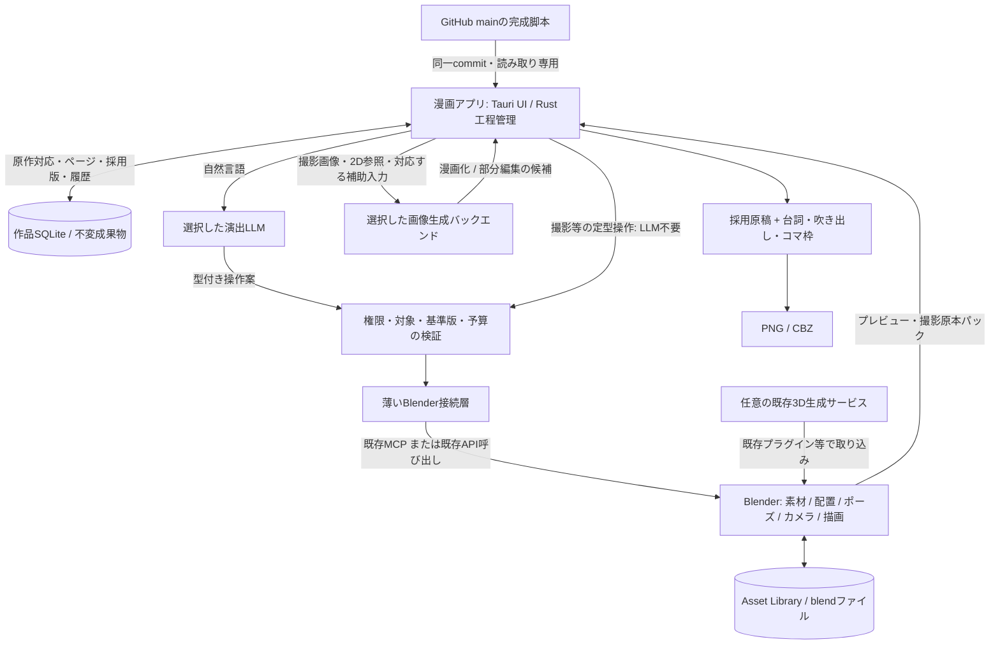
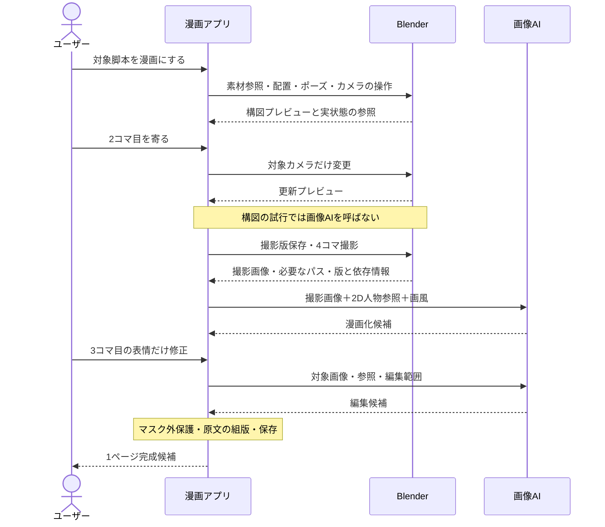

# Manga Mac 設計・実装計画 v4.0

更新日：2026-09-14。設計の正本：本リポジトリの `main` にある本書。

**Blenderで舞台・人物・カメラを扱い、撮影結果を画像AIで漫画化する。アプリは漫画データと工程を管理する。Blenderの既存機能・データを別実装に置き換えない。**

従来のv2/v3計画の「GitHubの完成脚本を保護する」「参照画像を実入力に使う」「非破壊の局所編集」「Mac用デスクトップアプリ」は継承する。3Dを後回しにする方針、独自3D素材台帳・Scene Graph・3Dビューワーを作る案は本書で置き換える。外部で配布した旧設計資料より本書を優先し、仕様を複数文書へ重複転載しない。

## 0. 現状と今回の範囲

これは設計更新であり、Blender連携を実装済みとするものではない。

| 項目 | 本書作成時の状態 |
|---|---|
| Tauri 2 + React/JavaScript + Rust、Swift画像ヘルパー | 初期実装あり。対象Mac実機の品質・性能は未検証 |
| GitHub mainのSHA固定取得、原文保持、参照付き2D生成、矩形編集、保存・Undo・PNG/CBZ | 初期実装あり。現状は[README](../README.md)参照 |
| 演出・顔推定LLMの接続先選択 | 初期実装あり。ローカル／外部APIを用途別に選択 |
| 画像生成 | 現状はローカルSwiftヘルパーのみ。外部LLMの選択と画像生成先は別 |
| Blender接続、3D素材利用、撮影パック、3D由来の漫画化 | 本書で定義する未実装項目 |
| 外部画像API、3D生成サービス、正式な日本語吹き出し組版 | 未実装の拡張。導入・実機検証前に完成扱いしない |

今回変更するのは文書のみ。既存2D制作経路・保存データ・API設定・ビルド構成を削除しない。目標経路は3D＋2Dの併用とし、既存2D経路は既存作品の互換性と比較試験のために保持する。3D機能の失敗を黙って2D生成へすり替えない。

## 1. 製品の不変条件

- 脚本は外部で完成し、原作リポジトリのmainが正本。アプリは同一commitの本文・設計・設定を読み取り専用で取得し、台詞・話者・順序・明示設定を創作／改変しない。原作へのpushやPR作成機能は持たない。
- 開発コードの正本は本リポジトリ。開発変更はブランチ→PR→mainで反映する。原作の読み取り専用運用とは区別する。
- 通常体験は「対象脚本を選ぶ→漫画候補を作る→必要箇所へ自然言語で指示→出力」。手描き、毎コマのプロンプト、ノード配線、Blender操作の習得を必須にしない。
- 3D形状・空間・ポーズ・カメラの確定値はBlender、原作はSourceSnapshot、漫画のページ・採用画像・工程履歴はアプリがそれぞれ唯一の正本。
- 3Dから2Dへ描き直す際の見た目・空間の一致は保証しない。参照添付、原文保持、変更範囲、履歴など機械的に検証できる保証と、視覚品質を分ける。
- 外部APIは利用者が用途・送信先・送信対象を明示的に選ぶ。ローカルからクラウドへの自動退避、別事業者への無断送信、無制限再試行を禁止する。
- Apple Silicon／24GBを評価条件とするが、機種・OSは実機で取得する。実測なしで性能、品質、完成単価を断定しない。

## 2. 既存機能を使う責務分担

新規実装前に **Blender標準機能→既存アドオン／MCP→不足する接続処理だけ追加→漫画固有機能** の順で調査する。

| 対象 | 正本・実行主体 | アプリが持つもの／持たないもの |
|---|---|---|
| 3D素材、分類、プレビュー、説明 | Blender Asset Library／Asset Browser／Catalogs [B1] | 参照・選択表示と再生成可能なキャッシュのみ。独立した編集可能素材台帳・分類体系は作らない |
| メッシュ、材質、骨格、ウェイト、ポーズ | Blender／既存のPose Library・アドオン [B2] | 自然言語から操作への橋渡し。モデラー、リグ、IK、ポーズエンジンは作らない |
| 素材の配置・再利用・局所変更 | BlenderのLink／Append／Library Overrides [B3] | どの人物にどの素材を使うかという作品上の対応のみ。独自シーン評価系を作らない |
| カメラ、照明、プレビュー、撮影 | Blenderのカメラ・描画エンジン・既存API [B4] | 操作要求と返却画像の表示。Three.js等による別の3D描画系は初期対象外 |
| 線画、深度、法線、物体領域、汎用合成 | Blenderの既存描画パス／Line Art／Compositor [B5] | 必要な出力を選んで利用。別の線画・深度レンダラーや汎用ノードエディタは作らない |
| 3D素材のAI生成 | Tripo等の既存プラグイン／公式API [B8] | 生成依頼・結果の参照・採否。独自生成エンジンや二重の生成ジョブ管理を作らない |
| 2Dキャラ正本、画風、作画・部分修正 | アプリ＋既存画像生成バックエンド | 参照の版・実入力・出力・修正意図・採否を管理 |
| 原作対応、ページ、コマ、台詞、吹き出し、工程、費用 | アプリ | 漫画固有のドメイン。Blenderへ無理に移さない |

アプリに「素材を選ぶ」画面を設けても、Blenderの情報を表示・操作する窓口にとどめる。完全なAsset Browserの複製は不要。APIで得られない操作は標準のAsset Browserを開く導線を先に使い、独自カタログを作って穴埋めしない。

新規モジュールのPRには、対応するBlender機能／API／既存拡張、採用する呼び出し経路、不足分と追加理由を記載する。接続処理と機能再実装を区別してレビューする。

## 3. システム構成

Blenderと画像AIが独立に作品を更新せず、成果物の採用はアプリが管理する。同じPC内の受け渡しは認可されたファイル参照・ハッシュを基本とし、3Dファイルや巨大画像を毎回UI経由でコピーしない。外部画像APIへは必要な画像を送り、通常はblendファイル自体を送らない。

### 接続・実行

`bpy`はBlenderのPython APIであり、アプリから直接HTTPで呼べるAPIという意味ではない。実行はBlender側で行い、既存MCP、既存アドオン、または必要最小限の接続アドオンを入口にする。MCPとPython APIに別々の操作実装を作らず、同じ操作アダプタへ集約する。[B4][B6]

| 操作 | 経路 |
|---|---|
| 「人物Aの肩越しから」などの意図解釈 | 選択LLM→型付き操作案→検証→MCP/API→Blender |
| 保存、撮影、素材選択、ポーズ適用等の定型処理 | アプリ→同じ検証・接続層→Blender。LLMを毎回呼ばない |
| 不足する操作 | 既存APIを呼ぶ検証済みラッパーだけ追加。描画や骨格計算を再実装しない |

製品の常用経路でLLM生成の任意Python・任意シェルを実行しない。既存MCPが汎用コード実行だけを提供する場合は、モデルへその機能を直接公開せず、検証済みテンプレートと型付き引数から構成するアダプタを使う。安全に制限できない場合は接続方式を変更する。MCPへの接続自体を安全性の根拠にしない。[B6]

起動時にBlenderの版・ビルド、接続拡張の版、プロトコル、対応操作、描画パス、GUIの要否を照合する。対応版は試験後に固定し、`latest`へ無条件追随しない。Blender API操作はBlenderが許容するメインスレッド／コンテキストで逐次実行し、通信スレッドから直接データを変更しない。GUI依存操作をheadlessで動くと仮定しない。[B7]

アプリ専用セッションを原則とし、ユーザーが編集中のBlenderへ無断接続・終了・上書きしない。接続はローカル限定、認証付き、許可フォルダ内に限定する。外部blendの自動スクリプト実行、任意アドオン導入、パス逸脱を許可しない。信頼していない素材を安全なPythonとみなさない。

## 4. 素材と状態の保存

### 4.1 正本と参照

| データ | 保存・権限 |
|---|---|
| SourceSnapshot | GitHub repo／commit／原bytes／取得順。不変。原作へ書き戻さない |
| CharacterBinding | 作品内人物ID→2D参照版＋Blender素材への参照。3D素材の内容や分類を複製しない |
| BlenderAssetRef | 許可済みライブラリ内のファイル・datablock・版／依存ハッシュ。Blenderから解決する |
| ShotBinding | コマ→blendチェックポイント・Scene・Camera・frame・View Layer。座標や骨格の独立正本は持たない |
| CaptureRevision | 撮影結果、使用版、依存素材、描画条件、補助画像、出力ハッシュ |
| ArtworkRevision | 撮影版、実入力参照、モデル・設定・費用、元画像・マスク・修正候補・採用版 |
| PageLayout / EditIntent / Job | 台詞ID、コマ枠、修正意図、対象範囲、工程依存、費用、復旧情報 |

CatalogのUUIDは分類のIDであり、個別素材の一意IDとして代用しない。[B1] 参照解決にはファイル・datablockと版を使う。名称変更等のID補助が必要ならBlender側の小さなcustom propertyで保持し、アプリ独自素材モデルへ拡張しない。解決不能なら要再対応付けとし、似た名前の別素材へ自動差し替えしない。

「二人を近づける」という編集意図や撮影記録として数値を保存してよいが、それを編集可能な第二の3D正本として使わない。座標の表示キャッシュはBlenderから再取得可能とし、Blenderで変更した結果を古いキャッシュで上書きしない。

### 4.2 舞台・瞬間・カメラ

同じ駅の素材は再利用する。同じ瞬間の別アングルは同じScene/frameを別カメラで撮る。次の瞬間の演技はBlenderのScene、Action、frame等で表現し、別のポーズエンジンを作らない。

リンクした共通素材の一部を編集する場合は既存Library Overrides等を用いる。[B3] 別コマで同じObject／Actionを意図せず共有してポーズが連動しないよう、選択範囲に必要なBlenderデータだけを分離する。メッシュやテクスチャを無条件に毎コマ複製しない。一方、コマ単位の局所修正に必要なインスタンス分離は省略しない。

### 4.3 保存版と素材更新

作業用blendは変更可能、採用に使うチェックポイントは変更不可に分ける。既存の保存・リンク・依存収集機能を呼び、採用版が参照するblend、外部ライブラリ、テクスチャ等を固定してハッシュ検証する。**パスを記録するだけでは、そのパスの中身が変わるため版固定にならない。**

利用者の素材ライブラリを勝手に複製・移動・書換えしない。再現に必要な固定コピーは共有の版保存領域へ一度保存し、複数コマから参照する。これは履歴用のスナップショットであり、第二の編集可能な素材管理システムではない。全依存を固定できない場合は再撮影可能と表示しない。

髪型等の更新は新素材版として扱い、使用コマへ更新候補を示す。完成済み画像と撮影版を自動上書きしない。Library Overridesの再同期等により結果が変わり得るため、新版の再撮影結果は候補として比較する。[B3]

## 5. 1ページを作る作業とデータの流れ

例は人工の4コマ会話：雨の駅の全景→人物Aの発言→人物Bの小さな笑顔→二人の横顔。ユーザー作品の脚本を変更する指定ではない。

| 手順 | ユーザーに見える操作 | 内部の処理・渡すデータ | 保存するもの |
|---|---|---|---|
| 1. 対象を選ぶ | 原作の場面を選び「漫画にする」 | アプリが同一SHAの原作を取得、コマ・台詞ID・画面比率を計画 | 原作取得版、ページ・コマ、原文対応 |
| 2. 素材を使う | 必要時だけ人物と素材を対応付け | アプリがBlender既存ライブラリを参照。既存素材を優先し、不足時だけ生成・取り込み | CharacterBinding、素材参照。中身はBlender |
| 3. 舞台・構図 | 4コマのプレビュー。「2コマ目を寄って」 | 型付き配置／ポーズ／カメラ操作→Blender。既存機能でプレビュー生成 | 作業用blend、ShotBinding、操作結果 |
| 4. 撮影 | 自動、または構図を選択 | Blenderが確定カメラから所定解像度で描画 | 版固定済み撮影パック |
| 5. 漫画化 | 作画候補がページに入る | アプリ→画像AIへ撮影画像＋人物・画風参照＋能力に応じたガイド | ArtworkRevision、送信した参照・設定・費用 |
| 6. 部分修正 | 「3コマ目の口元だけ少し笑う」 | 対象画像の領域を解決→画像AI→許可領域だけ合成 | 元絵、マスク、候補、修正意図。3Dは原則変更なし |
| 7. 組版・出力 | 台詞と吹き出しを確認、出力 | アプリが原文の文字列を配置しPNG/CBZへ出力 | 採用画像・文字・枠の対応と完成ページ |

初回の素材生成・リグ調整はページごとの必須工程ではない。Tripo等の出力が直ちに演技可能とは置かず、人物なら向き・尺度・リグ・衣装・接触ポーズを検査して採用する。既存リグや素材を優先し、自動生成の修復を無制限に続けない。

### 5.1 日本語原作と英語版

- 対応する作品言語は日本語と英語だけとする。アプリUI自体は日本語のままにし、任意言語コードやUI翻訳基盤は導入しない。
- GitHubから取得した日本語原作を唯一の正本とし、英訳は `snapshot_id + unit ID` に対応する派生版として保存する。原文、話者、段落ID、順序を変更しない。
- 英訳要求は全unit IDを一度ずつ同じ順序で返す型付き契約とし、欠落、追加、重複、空文、並べ替えを保存前に拒否する。資格情報は既存LLM接続境界を使い、作品データへ保存しない。
- 漫画と動画は同じ英訳版を参照する。漫画は文字層だけを日本語／英語で切り替え、採用済み作画を再生成しない。動画は同じunit IDからWebVTT等の字幕トラックを作り、映像素材を言語ごとに複製しない。
- 英訳がない、または対象snapshotと一致しない場合は「英語版」として日本語を黙って出力しない。画面で未作成を示し、PNG／CBZ／字幕の英語出力を拒否する。
- 原作新版の取得後も旧snapshotの英訳は履歴として保持する。新版用英訳は別版として作成し、旧英訳を自動流用・自動修正しない。
- 現段階の動画側は字幕データ契約とWebVTT生成までとする。字幕焼込み、吹替音声、口パクはIssue #9の初期無音1ショット範囲外であり、実装済みと表示しない。

## 6. 撮影パックと画像AIの接続

撮影はビューポートのスクリーンショットではなく、Blenderのカメラからの描画とする。[B4] 最小パックは通常画像、撮影版、カメラ／Scene／frame参照、解像度・色管理・seed等の設定、依存素材ハッシュ。深度・法線・線画・Cryptomatte等は必要なものだけ既存機能から出力する。[B5]

補助出力には座標系、寸法、色空間、深度の単位・正規化、物体ID対応を付ける。Cryptomatteの「Asset」はBlender素材ライブラリのIDとは同一ではない。全エンジン・全材質・全描画設定で同じパスが得られると仮定しない。[B5]

画像アダプタは参照画像枚数、画像編集、mask、depth、normal、pose、line、最大解像度、課金方式等の能力を確認する。名前は接続契約の能力項目であり、既存プロバイダのAPI名を捏造するものではない。未対応の深度画像を普通の参照画像として渡して「深度拘束済み」と扱わない。

まず撮影画像と2D正本で漫画化し、モデルが対応するガイドだけ追加する。2D人物正本は3Dモデルの見た目と独立して実入力に含め、ID・版・ハッシュ・順番を記録する。必要参照を黙って省かない。全面変換の構造保持は検査対象であって保証ではない。

NPR／Line Artのみで十分なコマはそのまま利用可能にし、画像AIの使用／不使用自体を目標にしない。画像AIは補修専用ではなく通常の作画工程として利用できる。[B5]

## 7. 修正の振り分けと保護

| 指示 | 変更する正本 | 再実行範囲 |
|---|---|---|
| 二人の距離、身体ポーズ、カメラ角度 | Blenderの対象ショット | 対象の再撮影→必要な漫画化 |
| このコマの口元・目線の小修正 | 2D作画版 | 領域の再編集・合成。通常Blenderへ戻さない |
| 次のコマも同じ表情 | 次の演技意図と必要なBlender表情指定 | 次コマに適用。修正済み2D顔を自動3D復元しない |
| 線・トーン・背景の省略 | 作画／合成設定 | 撮影原本を再利用して必要な仕上げ |
| 吹き出しの移動・文字配置 | ページレイアウト | 組版のみ。LLM・画像AI・3D再撮影は不要 |
| 人物素材の更新 | Blender素材の新しい版 | 利用コマに候補を作る。既存採用版は不変 |

全操作に対象ID、`scope`、原作版、`base_revision`、編集意図、予算を付ける。既定scopeは選択コマ／選択人物。場面全体の修正は明示指定に限る。図の正しさをDBの状態保存だけで保証しない。

2D修正後にカメラを変えた場合は、修正意図と採用顔を参照に新しい候補を作る。旧画像や旧マスクを新角度へそのまま適用しない。漫画化で輪郭が変わるため、3D由来の領域は手掛かりとし、完成画像上で領域を再確認する。安全に分離できなければ要確認とする。

既存の領域合成・マスク外RGBA保護を維持する。汎用合成はBlenderのCompositor等を優先しつつ、モデルがmaskを守ることに依存しない最終画素保護は検証済みの既存処理を使う。二重の汎用画像処理基盤を作らない。境界処理も許可マスク内で行い、最後の全体色変換・リサイズでマスク外を変えない。

## 8. UIとプレビュー

主画面はページ一覧・漫画プレビュー・選択対象・自然言語欄・Undo・出力。コマ内で「Blenderプレビュー／撮影原本／漫画原稿」を切り替える。素材棚はBlender情報への薄い窓口、2D参照棚はアプリの漫画情報として分ける。

初期はBlender生成画像の更新表示で構図確認する。独自WebGLビューワー、独自ギズモ・カメラ投影、Blender全UIの埋め込みを必須にしない。直接3D操作が必要な場合は標準ビューポート／Asset Browserを開く。プレビューの応答速度は実測し、MCP接続だけで動画並みの操作感を保証しない。

自然言語だけでなく「寄る／引く」「別構図」「撮影」の定型操作を置けるが、実処理は既存Blender操作を呼ぶ。生成中の画面位置・入力・選択を保持し、毎コマ確認を強要しない。素材不足・設定矛盾・課金上限・安全な編集不能だけを例外として示す。

## 9. 履歴・依存・費用・復旧

依存は `SourceSnapshot→PanelPlan→ShotBinding/CaptureRevision→ArtworkRevision→PageLayout/Export` とする。台詞だけの誤字修正は再組版、演技が変わる本文差分は対象の視覚依存を再評価する。原作全体のhash変更だけで全画像を再生成しない。

ジョブはキュー、入力ハッシュ、request ID、基準版、試行数、バックエンドjob ID、実行時間、費用、出力を保存する。Blender側の操作結果は実状態を読み返して確認する。ファイル保存・検証が成功してからDBの採用ポインタを切り替える。通信断で成功か不明な操作や課金要求は、既存jobの状態を照会し、盲目的に再送しない。

失敗・キャンセル・古い版の結果は採用済み成果物を壊さない。Undoは不変の画像／blendチェックポイントへ戻り、再推論しない。Blender標準Undoはそのセッション内の操作に利用できるが、アプリ再起動後の履歴保証の代替にはしない。DBと外部素材の整合を含めてバックアップ・復元を検証する。

費用は素材生成・検査・修正の初期費用と、完成ページの反復費用を分ける。構図探索はBlenderのみ、確定後に漫画化し、部分修正は対象コマだけ。領域が小さいだけでAPI料金が安くなるとは仮定しない。実料金／推定料金／未取得を区別し、古い固定単価を仕様へ埋め込まない。

品質再試行は初回＋最大2回を設計上限とし、課金再試行は利用者が許可した予算内に限る。回数を再起動でリセットしない。無断の自動リトライを既存実装に追加しない。外部サービスがすでに持つ進捗・再取得機能を再利用し、親子jobの対応だけアプリへ保存する。

24GB機ではBlender描画、画像モデル、ローカルLLM/VLMの重い処理を基本的に逐次化する。軽量プレビューを残すかBlenderワーカーを停止・再開するかは実測で決める。レンダラのGPUメモリが処理終了だけで必ず解放されると仮定しない。ユーザー所有プロセスを勝手に停止しない。

## 10. 現実装からの移行と導入

| 既存箇所 | 更新方針 |
|---|---|
| `src/pipeline.js` の原作取得・原文検証 | 保持。演出計画へBlenderショット参照を段階追加 |
| `generatePanel` の2D生成 | 廃棄せず画像アダプタとして整理。撮影原本を新しい入力に加える |
| `src/bridge.js`／Rust IPC | 同じ入口に薄いBlender接続を追加。UIから任意コード・任意パスを受け取らない |
| `src/llm.js`／設定画面 | 既存の用途別ローカル・外部API選択を保持。Blender操作案も同じ方針 |
| `src/render.js` の領域保護・出力 | 既存保護を回帰試験。汎用3D/合成エンジンへ拡張しない |
| `helper/` | 既存ローカル画像生成を保持。BlenderのPython実行はBlender側へ任せる |
| SQLite内の作品JSON | スキーマ版を付けて移行。旧2Dコマは `capture_revision = null` としてそのまま開く |

撮影画像・blend・マスク等の大きな成果物は不変ファイルへ分離し、DBは参照と履歴を保持する。既存JSON内画像の移行はバックアップ・ハッシュ照合・失敗時ロールバックを備える。今回は文書だけを変更し、移行処理は未実装。

BlenderはまずMacに別途インストールされた対応版を検出し、既存MCP／必要な接続拡張を設定する。独立アプリの同居を認める。BlenderやTripoの同梱を既成事実にせず、版互換性・配布条件・更新方法を確認する。Tripoは任意で、利用には通信とAPI認証が必要。[B8]

アプリ本体は引き続きデスクトップ配布。ユーザーにNode、Rust、Xcode等でのソースビルドを通常導入として要求しない。ローカル用モデル・素材がそろった経路はオフライン試験し、外部API選択時はオンライン要件を表示する。ブラウザ開発用モックを本番接続と混同しない。[導入ガイド](INSTALL_MAC.md)

## 11. 実装順序と受入条件

| 段階 | 作るもの | 完了条件 |
|---|---|---|
| 0. 既存機能の再利用調査 | 対応Blender/MCP/アドオンと操作対応表、最小接続試作 | 素材取得・カメラ変更・保存・描画・結果読戻しが実Blenderで通る。GUI/headless差と不足APIを記録 |
| 1. 4コマの撮影 | 検証済み二人・一場所を既存ライブラリから読み、4ショットを作る | 独自素材DB・独自描画系なし。選択コマのカメラ／ポーズ変更が他コマを変更しない |
| 2. 漫画化と局所編集 | 撮影パック→既存画像アダプタ→部分修正→文字組版 | 参照実入力、マスク外保護、再撮影時の旧作画保持、保存・再開が通る |
| 3. 既存3D生成サービス | 任意の生成・取り込み・検査を既存拡張へ接続 | 不足素材だけ生成。再接続で二重課金せず、採用後は既存Asset Libraryで再利用 |
| 4. 実機・配布検証 | 12コマ比較、24GBメモリ、クリーン導入、更新・復元 | 下記の機械試験と視覚・費用評価を別々に記録。未測定項目はnot_run |

必須の回帰・受入試験：

| ID | 試験 | 合格条件 |
|---|---|---|
| REUSE-01 | Blender素材を登録・分類変更してアプリで再取得 | 第二の素材登録なしで表示更新。アプリのキャッシュ削除後も復元可能 |
| STATE-01 | Blender側でポーズ／カメラを変更して再読込 | 実状態を反映。古いアプリキャッシュで巻き戻らない |
| SCOPE-01 | 共通素材を使う4コマのうち1コマだけ変更 | 対象外のObject/Action状態・採用画像は不変。共有データへの変更漏れがない |
| VERSION-01 | 外部素材とテクスチャを更新後に旧撮影版を開く | 旧版の依存を解決して再撮影可能。固定できなければ明示エラー。既存画像は不変 |
| CAPTURE-01 | 同じ撮影設定・入力を復元 | Scene・Camera・frame・素材・描画設定が一致。異なるGPU/版での画素完全一致は保証対象外 |
| EDIT-01 | 二人のうち一人の顔だけを修正 | 許可マスク外の正規化RGBA差分ゼロ、他コマと原文のハッシュ不変。マスク自体の妥当性も確認 |
| RETAKE-01 | 2D表情修正後にカメラを変更 | 旧原稿を保持。修正意図を引継ぎ、新角度の領域で新候補を作る |
| COST-01 | 10回構図変更、1コマ表情修正、吹き出し移動 | 構図変更の画像AI呼出0回。顔修正は対象のみ。文字移動の推論・再撮影0回 |
| RECOVERY-01 | Blender切断、応答不明、キャンセル、途中再起動 | 二重操作・盲目的な二重課金なし。採用版不変。既存完了成果物を再利用 |
| SECURITY-01 | 不正な脚本命令、パス逸脱、任意コード、未許可外部送信 | 実行拒否。秘密・原稿がログや別事業者へ漏れない |
| LEGACY-01 | 現行2D作品を移行・保存・Undo・PNG/CBZ出力 | 原文・画像・履歴を失わない。既存LLM接続先を削らない |
| SOURCE-01 | 原作新版・取得失敗・制作中更新 | 同一commit原則を維持。旧版不変。本文のみ変更で不要な再撮影をしない |

同じ人工脚本・二人・一場所の12コマで、(A)3Dの漫画調描画＋部分AI、(B)撮影PNG＋画像AI、(C)撮影パック＋参照＋編集履歴を比較する。品質基準をそろえ、初回素材費、完成ページ費、再試行、操作・待ち時間、意図しない変更、ピークメモリを測る。追加ガイドに効果がなければ削り、複雑さを目的にしない。

Linuxの契約／既存UI試験、macOSビルド、実Blender接続、実画像AI、対象Mac実機、署名・公証・クリーン導入を別判定にする。文書更新、モック成功、ビルド成功を実機品質の証拠にしない。

## 12. 動画1ショットへの共通参照（Issue #9）

漫画の原作・人物・作画・撮影版を再利用する。`videoShots`は既存snapshotId/sceneId/unitIds、人物ID、開始画像の不変版/hash、動きの指示、尺/寸法、採用動画版を持つ。原文や3D素材を第二の編集可能モデルへ複製しない。漫画コマを動画ショットの必須親にはしない。

schema 4へv1/v2/v3を互換移行し、既存panels/history/jobsと作品言語データを保持する。`videoRevisions`と`videoHistory`は動画用の版・Undoだけを担い、制作要求は既存jobsのscope=`videoShot`へ追加する。動画操作で漫画historyを変更しない。旧schemaのアプリへ戻す際は移行前の作品フォルダを復元し、version番号だけを書き換えない。

開始画像は既存ArtworkRevisionまたは固定CaptureRevisionから実bytesを解決・hash照合する。jobのmanifestへ原作commit、対象範囲、作成元版、接続ID/モデル、実入力hash、変換、指示、出力条件、基準採用版を固定する。`sourceDependencies`は開始画像の出所、`providerInputs`は実送信する開始画像1枚のみ。旧画像に存在しない人物参照版は捏造しない。現段階は画像変換を行わずidentityを記録する。変換を追加する場合は派生画像の実hashと変換矩形を別途固定する。

初期APIはRunway `gen4.5` image_to_video、5秒・無音。2026-09-16に公式[APIガイド](https://docs.dev.runwayml.com/guides/using-the-api/)と[公式SDKの固定型定義](https://github.com/runwayml/sdk-python/blob/8c49671dfb729bfd405b6bb93a9f70dc9706cb3f/src/runwayml/types/image_to_video_create_params.py)を確認した。初期許可ratioは1280:720/720:1280/1104:832/960:960/832:1104/1584:672、promptTextは1000 UTF-16 code units以内、画像は5MB以内。終了画像/depth/pose等を指定した要求は拒否する。API全体が対応する2〜10秒のうち、初期評価では5秒だけを扱う。

V-Aの実装は共通参照解決・manifest・保存移行まで。実API送信/動画ファイル保存/再生UIは後続V-B/Cであり、未接続の生成ボタンは表示しない。有料POST前にjobを永続化し、再起動でrunningはunknownへ変更する。未確定要求を再POSTせず、確定済taskを照会する。原作/入力/採用版の変更後に届く結果は候補に留める。試行上限は同じ採用版で3回、取下げでリセットしない。実行許可・予算・資格情報・task永続化はRust接続境界で追加検証するまで外部送信しない。

V-Bでは動画をRustのサイズ制限付き不変ファイルへ保存し、作品JSONにはartifact/hash/MIME/sizeのみを持つ。署名URL/秘密/巨大base64は保存しない。上限128MiB、64KiBバッファでstream→一時ファイル→sync→MP4コンテナ境界/hash再検証→hash名へのno-clobber公開→DB参照保存とする。コンテナ境界確認はcodecの完全decodeではなく、再生時はOSの既存decoderで確認する。受領結果は最初も候補とし、採用前に基準manifestと実ファイルを再検証。videoHistoryのUndoは対象shotの採用ポインタのみを復元する。

再生は[Tauri asset protocol](https://v2.tauri.app/reference/config/#assetprotocolconfig)を利用し、初期scopeは空。DBに記録されたrevision IDから正規ファイル/hashを照合して、その一ファイルのみallow_fileする。任意パス・フォルダの公開は行わない。MP4書出しはRust側でファイルcopyと再hashを行い、画像用base64 exportを経由しない。JSONバックアップには動画本体がないため、mediaディレクトリを含む作品フォルダ全体を保管する。

### V-Cの接続候補

Rustの`runway.rs`で公式RESTだけを呼び出す。既存Connectionsへ動画用のメモリ限定credentialを保持し、既存PolicyTransportのDNS固定/private-address拒否/no-proxy/no-redirectを利用する。演出LLMの設定とは独立し、動画の案は既存askLLMと原文対応検証を再利用する。Node/Python常駐プロセスや二つ目の汎用ジョブ台帳を追加しない。

APIは`https://api.dev.runwayml.com/v1/image_to_video`、`X-Runway-Version: 2024-11-06`、gen4.5/5秒/MP4固定。開始画像はRustで既存作画/固定撮影から再解決し、実bytes・hashを照合する。[公式入力仕様](https://docs.dev.runwayml.com/assets/inputs/)で5MBはbase64化後のData URI全体の上限であることを確認し、v1のdecode後サイズ判定を修正。初期実装はPNG/8192px以下/縦横比0.5〜2かつ出力ratioと厳密一致だけを送信する。サービス側の自動中央cropを避けるため、異なる比率を送信前に拒否する。余白付き派生画像を追加する場合は変換/hashを保存する別差分とし、現在は変換なし。

POST前に既存job.remoteへunknown・予約費用・送信日時をSQLite commitする。受信task IDを即保存。古いUI保存でremoteの削除/巻戻しを許さず、送信後のmanifest等を固定する。新規POSTは同じjobで一回だけ。再起動は既存taskのGETに戻し、取得完了artifactがUI保存前に残った場合も候補として一度だけ再接続する。API成功とローカル保存・採用を分ける。

[公式料金](https://docs.dev.runwayml.com/guides/pricing/)を2026-09-16に確認し、12 credits/秒×5秒=60 creditsを事前予約する。利用者は作品累計予約上限60〜6000を指定。失敗・成否不明・取消でも枠を勝手に戻さず、接続再登録でリセットしない。実績が予約額を上回った場合は料金再確認まで新規生成を拒否する。APIに請求上限を強制するパラメータがあるとは仮定せず、サービス側の請求確認と区別する。

task状態はPENDING/THROTTLED/RUNNING/SUCCEEDED/FAILED/CANCELLEDと取消要求中/成否不明を区別する。手動照会は5秒以上間隔をあけ、自動pollや自動再POSTは行わない。公式DELETEは実行中の取消と完了結果の削除を兼ねるため、画面でその影響を明示してから呼ぶ。ローカルの照会停止を取消完了と表示しない。

出力取得は[公式出力資料](https://docs.dev.runwayml.com/assets/outputs/)の`dnznrvs05pmza.cloudfront.net`だけを初期許可し、別ホストは拒否する。APIキーを付けずDNS/redirect/MIME/128MiB上限を検証し、署名URLはメモリ内だけで扱う。期限切れや取得失敗は同じtaskから再取得し、新規生成へ退避しない。実APIが別CDNを返す場合は公式根拠・明示許可・安全境界テストを揃えて許可範囲を更新する。

V-Dは既存Blender撮影の共通解決を利用する。現状の撮影画像は共通入口で解決できるが、漫画コマを作らずに動画専用camera/frameを割り当てるUIとMV-11の実Blender受入は残件。受入MV-01〜11はIssue #9を参照し、共通テスト・HTTP fixture・Mac再生・実API・実Blenderを別々に判定する。

## 13. 参照資料と未確定事項

一次資料（2026-09-14参照。`latest`は説明用リンクであり依存固定値ではない）：

- [B1: Asset Libraries](https://docs.blender.org/manual/en/latest/files/asset_libraries/introduction.html)、[Asset Browser](https://docs.blender.org/manual/en/latest/editors/asset_browser.html)、[Catalogs](https://docs.blender.org/manual/en/latest/files/asset_libraries/catalogs.html)
- [B2: Pose Library](https://docs.blender.org/manual/en/latest/animation/armatures/posing/editing/pose_library.html)
- [B3: Library Overrides](https://docs.blender.org/manual/en/latest/files/linked_libraries/library_overrides.html)
- [B4: Blender Python API](https://docs.blender.org/api/current/index.html)、[Command-line rendering](https://docs.blender.org/manual/en/latest/advanced/command_line/render.html)
- [B5: Render Passes](https://docs.blender.org/manual/en/latest/render/layers/passes.html)、[Line Art](https://docs.blender.org/manual/en/latest/grease_pencil/modifiers/generate/line_art.html)
- [B6: Blender MCP Server](https://www.blender.org/lab/mcp-server/)
- [B7: Python threading limitations](https://docs.blender.org/api/current/info_gotchas_threading.html)
- [B8: Tripo公式Blender拡張](https://github.com/VAST-AI-Research/tripo-3d-for-blender)

未確定：採用Blenderと接続拡張の組合せ・固定版、Asset Browser操作のAPI到達範囲、プレビュー応答性能、外部画像APIの採用先、生成3Dのリグ品質、漫画化の一致率、24GB実機の同時常駐可否。これらは段階0〜4の実測で決め、既存機能があるという理由だけで自動化の品質まで保証しない。
